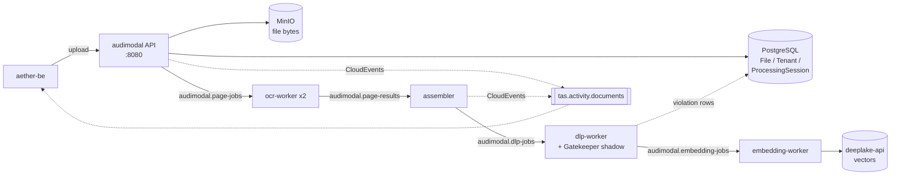

# AudiModal.ai

*Document ingestion and content scanning for the Tributary AI Services (TAS) platform.*

## What this is

AudiModal is the ingestion half of TAS. You give it a file — a scanned contract, a spreadsheet, an email archive — and it turns that file into text, chunks, findings, and vectors that the rest of the platform can search and reason over. Along the way it extracts text (falling back to optical character recognition for scanned pages), splits the document into chunks, scans each chunk for personally identifiable information (PII), generates embeddings, and writes those vectors to the DeepLake service. File bytes live in MinIO; the `File`, `Tenant`, and `ProcessingSession` records that track all of it live in PostgreSQL. Everything is scoped to a tenant.

It is not the user-facing application — that is `aether` and `aether-be`. It is not the vector store; it writes into `deeplake-api` and does not own the index. It is not a model gateway; document text never goes to a language model through this service.

The extractors are one Go package per family:

```console
$ ls -d pkg/readers/*/ | xargs -n1 basename | tr "\n" " "
archive csv email html image json markdown microsoft office pdf rtf text xml
```

## Status & scope

**As of 2026-09-17.** AudiModal runs on the TAS k3s cluster in namespace `aether-be`, alongside the Aether backend and the DeepLake service, as five deployments:

| Deployment | Ready | Image |
|---|---|---|
| `audimodal` (the API server) | 1/1 | `audimodal:am22-s3-path-3424701` |
| `audimodal-ocr-worker` | 2/2 | `audimodal:latest` |
| `audimodal-assembler` (joins a file's per-page OCR results back into stored chunks, then queues them for scanning) | 1/1 | `audimodal:am8-cloudevents-only-f1e262f` |
| `audimodal-dlp-worker` | 1/1 | `audimodal:g6-93f5615` |
| `audimodal-embedding-worker` | 1/1 | `audimodal:latest` |

All five are running and the API server reports healthy. The service has no ingress: it is reachable in-cluster at `audimodal.aether-be:8080` and from outside through the `audimodal-nodeport` service on port `30084`, so there is no public hostname to hand anyone. The assembler was rolled on 2026-09-16 to an image built from `f1e262f`, the feature commit PR #32 merged. The API server was rolled again on 2026-09-16 to `am22-s3-path-3424701`, built from `3424701` in PR #34, which fixed processing of directly uploaded non-PDF files; it carries the same activity-event code described under *How it fits*, since #34 branched from the merged #32. The optical character recognition (OCR), data loss prevention (DLP), and embedding workers were not rebuilt; their pods date from earlier in 2026, and neither PR changed their binaries.

Deployed is not the same as busy. Loki does hold audimodal streams for the last 30 days, but the only document traffic in them is verification uploads on 2026-09-16 and 09-17 under tenant `4c71b774-df6b-429e-9cce-1f4e00458386`, which ran end to end — the assembler logged `File a9cde0ee-fc9f-48f4-93d0-3176453bf5a1 assembled: 1 chunks created, 0 pages failed` and the DLP worker scanned the chunk a second later. Outside that, the pipeline is idle. Treat any throughput number you find in this repository as unmeasured.

Four things a newcomer will otherwise get wrong:

**Content scanning records, it does not block.** The data loss prevention (DLP) worker runs with `DLP_SHADOW_SCAN=true`. Gatekeeper is TAS's shared content-scanning Go library — PII, credential, and injection detection — kept in its own `Tributary-ai-services/Gatekeeper` repository, whose own front page lists the LLM router, the Model Context Protocol proxy, aether-be, and AudiModal as its consumers; it was originally extracted from AudiModal's `pkg/dlp` and has since grown past it. The flag wraps AudiModal's own scanner in a Gatekeeper shadow which dual-runs both engines and logs the per-type difference, then returns AudiModal's result unchanged (`pkg/dlp/shadow/scanner.go:1-18`, wired at `cmd/dlpworker/main.go:80`). AudiModal stays authoritative; a Gatekeeper error is logged and swallowed. Nothing Gatekeeper finds is redacted, quarantined, or blocked. The point of the shadow is to size the gap before any cutover — AudiModal's own scanner advertises five pattern types (`pkg/dlp/scanner/basic_scanner.go:150`) against Gatekeeper's much wider set. Here is the worker announcing the shadow and, an hour later, the single diff it recorded that day — this is what "measure-only" looks like in practice:

```text
2026/07/17 20:36:04 [DLPWorker] Gatekeeper shadow scanning ENABLED (log-only diff; audimodal authoritative)
[DLPWorker][gk-shadow] 2026/07/17 21:37:28 dlp-shadow: gatekeeper_only=[aws_access_key:1 aws_secret_key:1 connection_string:1 credit_card:1 private_key:1 sql:1] both(audimodal/gk)=[email:2/2 phone_number:1/1 ssn:1/1]
```

**Authentication is a length check, not verification.** `AuthenticationMiddleware` (`internal/server/middleware.go:150-191`) accepts any `X-API-Key` of 32 characters or more without consulting the database, and accepts any `Authorization: Bearer` header without validating the token — both paths carry a TODO comment saying so. Separately, `/api/v1/tenants` and `/api/v1/tenants/{id}` are registered through a pass-through `noAuthMiddleware` (`internal/server/server.go:383-399`), so tenant metadata is readable with no header at all. Do not put untrusted traffic in front of this.

**The enterprise connectors and the sync framework are unreachable code.** `pkg/connectors/` contains packages for Box, Confluence, Dropbox, Google Drive, Notion, OneDrive, SharePoint, and Slack. No file in this repository imports `pkg/connectors`. `pkg/sync` is imported only by `internal/api/sync_controller.go`, which is itself imported by nothing under `cmd/`. They compile; no running process can reach them. `ROADMAP.md` marks both categories 100% complete, along with "Authentication ✅ Complete 100%" — that file has not been maintained and should not be used to judge status.

**CI is red, and was already red before you got here.** Of the twelve most recent workflow runs — Tests and CI/CD Pipeline, on `main` and on pull requests, the newest from 2026-09-16 — the eleven that finished all failed, and the twelfth was still running when checked. The two workflows fail for different reasons. Tests never reaches a test: it stops at its `Run go fmt` step, and `gofmt -s -l .` still reports 35 files at this commit. Its job matrix also lists Go 1.22 and 1.23 beside 1.24 (`.github/workflows/test.yml:20`) while `go.mod` requires 1.24, so two of the three legs cannot compile the module. CI/CD Pipeline does get to its tests, and fails in the `Run tests` step of its `Test and Lint` job (`.github/workflows/ci-cd.yml:103-109`), because that step includes the `./tests/...` integration suite with no services behind it — on the 2026-09-16 run on `main`, `TestContainerEnvironmentConfiguration` and the DeepLake tests failed with `Get "http://audimodal:8080/health": dial tcp: lookup audimodal on 127.0.0.53:53: server misbehaving`. This is the same suite that fails locally, described under *Test it*. `main` has no branch protection, so a pull request here does not need a green check to merge — and a red check is not evidence that you broke something.

The interface spec in `api/openapi.json` describes 36 paths and 54 operations. Earlier revisions of this page claimed 90 or more endpoints; that number was never true of this spec.

## Quick start

Two paths. The first gets you a build and a test run on a laptop. The second gets you a real response out of the deployed service.

### Build it

A plain build fails, and the error does not name AudiModal:

```console
$ go build ./...
github.com/flier/gohs/internal/hs: exec: "pkg-config": executable file not found in $PATH
```

That is Gatekeeper's scanner reaching for its cgo Hyperscan engine. Select the pure-Go regexp engine with the `nohs` build tag, which is exactly what the Dockerfile does for the DLP worker (`Dockerfile:35`) and what CI sets globally (`.github/workflows/test.yml:12`):

```console
$ go build -tags nohs ./... && echo "build ok"
build ok
```

Gatekeeper is a versioned module requirement, not a sibling `replace` (`go.mod:33`), and so is the CloudEvents library the activity publisher uses, `aether-shared/go-events` (`go.mod:34`). The commit that introduced it described a `replace` directive, but none is in `go.mod` today, so the repository builds standalone with nothing checked out next to it.

### Test it

The DLP packages and the event publisher — the parts of the tree that changed most recently — pass. `pkg/events` had no tests before the activity publisher landed; it now carries five, including one pinning that the two confidence fields never fill each other:

```console
$ go test -tags nohs -count=1 ./pkg/dlp/... ./pkg/events/...
?   	github.com/jscharber/audimodal/pkg/dlp	[no test files]
ok  	github.com/jscharber/audimodal/pkg/dlp/compliance	0.005s
ok  	github.com/jscharber/audimodal/pkg/dlp/patterns	0.009s
?   	github.com/jscharber/audimodal/pkg/dlp/scanner	[no test files]
ok  	github.com/jscharber/audimodal/pkg/dlp/shadow	0.034s
?   	github.com/jscharber/audimodal/pkg/dlp/types	[no test files]
ok  	github.com/jscharber/audimodal/pkg/events	0.008s
```

The full suite does not. Running `./tests/... ./pkg/... ./internal/...` at commit `b6ae459` on 2026-09-16, with no source changes, 20 packages pass and 4 fail. That is the Makefile's package set: its `grep -v -E "(cmd/|controllers)"` filter removes nothing from those three trees today.

```console
$ go test -tags nohs -count=1 ./tests/... ./pkg/... ./internal/... 2>&1 | grep -E '^FAIL\s'
FAIL	github.com/jscharber/audimodal/tests	7.947s
FAIL	github.com/jscharber/audimodal/pkg/preprocessing	0.013s
FAIL	github.com/jscharber/audimodal/pkg/readers/pdf	0.283s
FAIL	github.com/jscharber/audimodal/pkg/readers/pdf/mapreduce	0.258s
```

These failures pre-date this document and are unrelated to it — nothing in the working tree was modified to produce that run, and the same four packages failed at `a96cde3`. Each has a distinct cause worth knowing before you chase it:

- `pkg/preprocessing` fails one subtest, `TestFileDecompressor_DetectCompressionType/TAR_GZ_file`: `pkg/preprocessing/decompressor_test.go:71` reports `Expected compression type 'tar.gz', got 'gzip'`. The detector classifies the `.tar.gz` fixture as plain `gzip`; nothing outside that subtest was traced.
- `pkg/readers/pdf/mapreduce/types_test.go:33` asserts defaults that the code no longer has — `got 300, expected 150` for the page-scan resolution, `got 600, expected 300` for the timeout, and `got 2048, expected 1024` for the memory ceiling. The test is stale, not the code.
- `pkg/readers/pdf` shells out to poppler and tesseract. Having them installed does not help: on a machine with `/usr/bin/pdftotext` present the tests still fail, because they point it at a file that does not exist — `pdftotext failed: exit status 1 (stderr: I/O Error: Couldn't open file '/mock/path/test.pdf': No such file or directory.`
- `github.com/jscharber/audimodal/tests` is an integration suite that expects services on the hostnames `audimodal` and `deeplake-api`: `Get "http://deeplake-api:8000/api/v1/health": dial tcp: lookup deeplake-api on 10.255.255.254:53: no such host`. The Tests workflow supplies a WireMock stand-in for DeepLake (`.github/workflows/test.yml:25`); the CI/CD Pipeline workflow defines no services, which is why its `Run tests` step fails the same way. Locally, how long it takes to fail depends on your resolver — eight seconds on 2026-09-16 when the lookup returned `no such host`, nearly five minutes on 2026-08-26 when the same lookup timed out.

`make test-unit` runs the narrower set CI uses first, and is the faster loop.

### Call the deployed service

There is no public hostname. Either forward the in-cluster service, which works from anywhere your kubeconfig does:

```console
$ kubectl port-forward -n aether-be svc/audimodal 8084:8080
Forwarding from 127.0.0.1:8084 -> 8080
Forwarding from [::1]:8084 -> 8080
```

or, from the node's local network, call the `audimodal-nodeport` service on the node address directly (`192.168.68.63:30084`). The port-forward output above is from 2026-08-26; the responses below were captured through the NodePort on 2026-09-16, and the two paths reach the same pods, so substitute `localhost:8084` if you forwarded.

Health needs no credential. The three checks are the database, process memory, and disk (`internal/server/server.go:74-80`):

```console
$ curl -s http://192.168.68.63:30084/health | jq .
{
  "service": "audimodal",
  "status": "healthy",
  "summary": {
    "degraded": 0,
    "healthy": 3,
    "unhealthy": 0,
    "unknown": 0
  },
  "timestamp": "2026-09-16T17:55:07.061610735Z",
  "version": "1.0.0"
}
```

Anything tenant-scoped does need one, and this is the first wall most people hit:

```console
$ curl -s http://192.168.68.63:30084/api/v1/tenants/1d644409-fc3d-4036-bbf5-16c869b5b88c/files
Authentication required
```

The credential is an API key sent in the `X-API-Key` header. For the k3s test suite it is `AUDIMODAL_API_KEY`, sourced from `apps/audimodal/api-test.env` in the `aether-secrets` repository (`Makefile:164-174`) — that file is absent there today, so `make test-k3s-with-secrets` currently exits with its own "not found" message.

The one real caller uses a different source. aether-be reads `AUDIMODAL_API_KEY` from its environment (in `internal/config/config.go` of the aether-be repository) and sends it as `X-API-Key`; most of its call sites, `RegisterFileFromS3` among them, substitute the literal `default-api-key` when the variable is empty (`internal/services/audimodal.go` in aether-be). In the cluster that variable comes from Kubernetes secret `aether-backend-secret`, key `AUDIMODAL_API_KEY`, namespace `aether-be`, loaded whole into the `aether-backend` deployment through `envFrom`; the base URL, `http://audimodal.aether-be:8080`, comes from configmap `aether-backend-config`. So what a stranger should use today is that secret key — read it with cluster access, never copy it into a file. Because AudiModal only measures the key's length, any 32-character string gets the same answer, and that fallback `default-api-key`, at 15 characters, would be rejected. With the key exported as `AUDIMODAL_API_KEY`, the call looks like this; the response shown was captured with an arbitrary 32-character string in that variable, which the service cannot tell apart from the real key:

```console
$ curl -s -H "X-API-Key: $AUDIMODAL_API_KEY" \
    http://192.168.68.63:30084/api/v1/tenants/1d644409-fc3d-4036-bbf5-16c869b5b88c/files | jq .
{
  "success": true,
  "data": [],
  "meta": {
    "pagination": {
      "page": 1,
      "page_size": 20,
      "total_pages": 0,
      "total_count": 0,
      "has_next": false,
      "has_prev": false
    },
    "count": 0
  },
  "timestamp": "2026-09-16T17:55:12.379806648Z",
  "request_id": "req_1789581312376805085"
}
```

A key shorter than 32 characters also returns `401`, with the body `Invalid API key` (`internal/server/middleware.go:184-187`); a tenant identifier that is a well-formed UUID but absent from the database returns `404` with the body `Tenant not found`. A `200` from this service therefore proves only that your key is long enough — see the authentication note under *Status & scope* before you conclude anything from it.

> [!UNVERIFIED] `docker-compose.yml` brings up the API server and a PostgreSQL container with `AUTH_ENABLED=false` on host port 8084. That path was not exercised for this document; only the Go build, the test runs, and the cluster calls above were.

## How it fits

AudiModal has one synchronous entry point and a four-stage asynchronous pipeline behind it. The API server accepts an upload, stores the bytes, and publishes a job; four worker binaries pass the document along Kafka topics (`pkg/events/kafka_messages.go:9-13`) until vectors land in DeepLake.



Startup and processing need different things. The API server's `main` pings PostgreSQL once and exits on failure — `gorm.Open` pings by default (`internal/database/connection.go:60`), the call is fatal (`cmd/server/main.go:221-233`), and nothing retries: `WaitForDatabase` exists in `internal/database/database.go` but no caller uses it, so recovery is Kubernetes restarting the pod. The same happens if migrations are pending while `DB_AUTO_MIGRATE` is not `true`, which is the cluster setting (`cmd/server/main.go:242-255`). With authentication on, a missing `JWT_SECRET` is also fatal (`cmd/server/main.go:215-217`). Nothing else is contacted at startup — the Kafka writer, the S3 client, and the DeepLake and OpenAI clients are built without dialling anything.

| Dependency | API server | Workers |
|---|---|---|
| PostgreSQL | **Start**: exits if unreachable | **Start**: assembler, DLP, and embedding workers exit if unreachable (`cmd/assembler/main.go:58`, `cmd/embeddingworker/main.go:48`); the OCR worker does not connect |
| Kafka | Processing only: the writer is created without connecting (`pkg/events/simple_producer.go:25-39`); uploads succeed and nothing is queued | Processing only: the reader and writer connect on first use |
| MinIO (S3) | Processing only: the client is built in `init` from environment and a failure is a warning (`internal/server/handlers/file.go:31-37`); without it the splitter is not created (`internal/server/handlers/file.go:79-83`) | Processing only: constructor failure is fatal, but the constructor makes no network call (`internal/services/s3_uploader.go:26-62`) |
| DeepLake | Processing only | Embedding worker: `DEEPLAKE_API_URL` and `DEEPLAKE_API_KEY` must be **set** at start or it exits; the service itself is first contacted when a chunk is embedded (`cmd/embeddingworker/main.go:229-242`) |
| OpenAI | Processing only: a missing key logs a warning and disables in-process embedding (`internal/server/handlers/file.go:66-73`) | Embedding worker: `OPENAI_API_KEY` must be **set** at start (`cmd/embeddingworker/main.go:229-232`); the API is contacted per chunk |

The hard dependency at runtime is PostgreSQL, at `postgres-shared.tas-shared.svc.cluster.local:5432`. Every tenant-scoped route resolves the tenant through a database lookup before dispatch (`internal/server/middleware.go:195-220`), so with the database unreachable every route below `/api/v1/tenants/{id}/` fails and the `database` health check flips the service to unhealthy.

Kafka is softer than it looks. The API stays up and uploads still get stored, but nothing is queued, so documents sit at rest and never reach the workers. Note that the server cannot tell you this at startup: it has a warning branch for a failed producer (`internal/server/server.go:352-357`), but `NewSimpleProducer` builds a `kafka.Writer` and always returns a nil error (`pkg/events/simple_producer.go:25-39`), so the log always reads `Kafka event producer initialized` whether or not a broker is reachable, and the trouble first appears as a failed publish. The activity publisher below is softer still — it is created whenever `KAFKA_BROKERS` is non-empty, which its default of `localhost:9092` guarantees, so it exists regardless of `KAFKA_ENABLED` (`internal/server/server.go:361-367`), and a failed write costs one log line and nothing else.

MinIO at `minio-shared.tas-shared.svc.cluster.local:9000` holds the bytes; DeepLake at `deeplake-api:8000` receives the vectors at the end of the chain. Gatekeeper is a linked library, not a service — there is nothing to be up or down.

The dotted arrow is worth one sentence, because it is where scanning becomes durable: for every finding the DLP worker writes a `DLPViolation` row into PostgreSQL, attached to a per-tenant system policy it creates on demand (`cmd/dlpworker/main.go:249-252`, `cmd/dlpworker/main.go:335-360`). That write is where a tenant mismatch between services surfaces, as it did on 2026-07-17:

```text
2026/07/17 21:37:28 [DLPWorker] Failed to create system policy for tenant 3ec05a0c-d3df-47b5-8c94-3529c33dab46: ERROR: insert or update on table "dlp_policies" violates foreign key constraint "dlp_policies_tenant_id_fkey" (SQLSTATE 23503)
2026/07/17 21:37:28 [DLPWorker] Chunk 98376802-cb7f-484c-8282-931393c23b3f scanned: pii=true, findings=4, risk=0.85, duration=477ms
```

The scan still ran and the chunk still moved down the pipeline; only the violation rows were dropped, because the job named a tenant that has no row in AudiModal's own `tenants` table.

On the other side, `aether-be` is the caller: it uploads on a user's behalf and reads processing state back. Both live in namespace `aether-be`, and that namespace has no NetworkPolicy objects, so nothing stands between them at the network layer.

### Activity events

Separately from the pipeline topics, AudiModal announces what happens to each document on the Kafka topic `tas.activity.documents` (`pkg/events/activity_publisher.go:17`). aether-be's streaming consumer reads it to feed the Live Streams page — the real-time activity feed in the Aether web app (`aether/src/pages/StreamingPage.jsx`), which receives events over a WebSocket from a hub in aether-be (`aether-be/internal/streaming/hub.go`) that fans each event out to the connections of the matching tenant — and the commit history names a TimescaleDB events table fed from the same topic. These are not the events aether-be uses to keep its own Neo4j records in step: that job still belongs to the legacy `ProcessingCompleteEvent` and its failure counterpart, published on the `processing.complete` and `processing.failed` topics (`pkg/events/simple_producer.go:84-87`), and both kinds are sent side by side.

There are three event types — `com.tas.activity.document.uploaded`, `.processed`, and `.failed` (`pkg/events/activity_events.go:14-18`) — and every message is a single CloudEvents 1.0 document in structured mode, source `urn:tas:service:audimodal`. Until PR #32 each event went out twice, once as a CloudEvent and once in an older "Envelope v1" format — a TAS-specific JSON wrapper with its own schema-version field that predates the move to the CloudEvents standard. That second copy is gone: aether-be's consumer already recognised either format from the content-type header, so the migration window it existed for was never needed (`pkg/events/activity_publisher.go:28-36`). A consumer that only understands the old envelope will see nothing from this image onward.

Two processes publish, and they cover different exits. The API server announces `uploaded` for both multipart and JSON file registration, and `processed` or `failed` for the paths it finishes itself — a splitter submit failure (stage `split`; the splitter is the API server component that cuts an uploaded PDF into per-page jobs on `audimodal.page-jobs`, `internal/processors/splitter.go:24`) and the in-process pipelines (stage `process`). The assembler announces `processed` or `failed` for files that went through the page pipeline, with stage `assemble`. One edge to know: a file where some pages failed but under the 20% bail-out threshold is stored with status `processed` and still announced as `document.failed`, because the assembler treats any failed page as a failed event (`cmd/assembler/main.go:243`, `cmd/assembler/main.go:526-539`).

`DocumentProcessedPayload` carries two confidence numbers that mean different things. `confidence` is the pipeline's quality score and is set only by the API server; `ocr_confidence` is the mean OCR word confidence and is set only by the assembler. They used to share one field, which made an ordinary text PDF — whose pages report OCR confidence 1.0 — show as 100% confidence on the Live Streams page.

The tenant id on the event is the one aether-be's WebSocket hub filters on, not AudiModal's own. When aether-be calls `/files` or `/process` it sends its tenant id (for example `tenant_1766596584`) in the `X-Aether-Tenant-Id` header, and the API server stamps that value on the event, falling back to AudiModal's internal tenant UUID when the header is absent (`internal/server/handlers/tenant.go:350-364`). An event carrying the internal UUID reaches the hub and is dropped before fan-out.

**Known bug: the assembler's events are dropped.** It has no request to read that header from, so its `processed` and `failed` events carry AudiModal's internal tenant UUID (`cmd/assembler/main.go:527`, `cmd/assembler/main.go:551`). aether-be drops any event whose tenant differs from the subscriber's — `Conn.accepts` compares the two and returns false (`internal/streaming/hub.go:89` in aether-be), and the connection's tenant is the caller's Aether space tenant (`internal/handlers/stream.go`). So a PDF processed through the page pipeline never reaches Live Streams for its tenant. Both sides were read on 2026-09-17; no message on the topic and no Live Streams session was observed, so the mechanism is confirmed from code while the symptom is not.

Publishing is fire-and-forget. The API server calls the publisher from a goroutine after the HTTP response is written, so the publisher ignores the request context — which is cancelled the moment the response flushes — and gives each write its own 2-second timeout (`pkg/events/activity_publisher.go:118-143`). Before that fix every upload logged `publish document.uploaded failed: context canceled` and produced no message. A failed write now logs `activity_publisher: publish <type> failed: <error>` and the upload still succeeds. On 2026-09-16 the API server logged `Activity publisher initialized` with topic `tas.activity.documents` at startup, and Loki held no `activity_publisher` failure lines for the previous 30 days.

> [!UNVERIFIED] No message on `tas.activity.documents` was read for this document; the Kafka topic was not inspected, and aether-be's logs for the same window show no line naming it. That events arrive is inferred from the absence of publish failures, not observed.

## Configuration

Everything is environment variables, read into `internal/server/config.go`. The ones that change behaviour:

| Variable | Default in code | In the deployment | What it does |
|---|---|---|---|
| `SERVER_PORT` | `8080` | not set | The only port variable the loader reads (`internal/server/config.go:17`, `cmd/server/main.go:79`). The manifest sets a shorter, differently-named port variable that nothing reads, so the listener lands on 8080 by default anyway. |
| `AUTH_ENABLED` | `true` | unset, so `true` | When false, the middleware waves everything through. `docker-compose.yml` sets it false. |
| `API_KEY_HEADER` | `X-API-Key` | unset | Header the key is read from. |
| `API_PREFIX` | `/api/v1` | unset | Prefix all routes hang off. |
| `DLP_SHADOW_SCAN` | off | `true` on the DLP worker | Dual-runs Gatekeeper and logs the difference. Record-only. |
| `KAFKA_ENABLED` | `false` (`internal/server/config.go:84`) | `true` | Off means uploads are stored but never processed. Does not turn off activity events. |
| `KAFKA_BROKERS` | `localhost:9092` (`internal/server/config.go:85`) | `kafka-shared.tas-shared:9092` | Broker for the API server's pipeline producer and its activity publisher. The assembler and the workers read `KAFKA_BOOTSTRAP_SERVERS` instead, set to `kafka-shared.tas-shared.svc.cluster.local:9092`. |
| `DB_AUTO_MIGRATE` | — | `false` | True in `docker-compose.yml`, false in the cluster. |
| `EAI_ENCRYPTION_KEY` | falls back to a hardcoded literal (`internal/server/server.go:336-338`) | unset | Encrypts stored storage-backend credentials. The cluster is running on the fallback. |

The API server container also carries two Go runtime settings, tuned against its 8Gi memory limit and 500m processor limit:

```text
GOGC=20
GOMEMLIMIT=4GiB
```

Secrets are Kubernetes secrets in namespace `aether-be`, referenced here by location only:

- `audimodal-secrets` — keys `db-username`, `db-password`, `minio-access-key`, `minio-secret-key`.
- `postgres-shared-secret` — keys `username`, `password`, used by the API server deployment.
- `aether-backend-secret` — keys `jwt-secret`, `DEEPLAKE_API_KEY`, and `AUDIMODAL_API_KEY` (the key aether-be sends to AudiModal).
- `openai-secret` — key `OPENAI_API_KEY`, used by the embedding path.
- The test API key lives outside the cluster, in the `aether-secrets` repository at `apps/audimodal/api-test.env`.

Server defaults also live in `config/server.yaml`, and the deployment manifests that set all of the above are in `deployments/kubernetes/`.

## Where to go next

- [DEVELOPER.md](./DEVELOPER.md) — build, test, and deploy mechanics in more depth than this page carries.
- [DEVELOPER_DOCUMENTATION.md](./DEVELOPER_DOCUMENTATION.md) — the long-form internals guide.
- [api/openapi.json](./api/openapi.json) — the interface spec, 36 paths. [docs/api/](./docs/api/) has per-area notes including [authentication.md](./docs/api/authentication.md), which describes the intended scheme rather than the one implemented today.
- [docs/architecture/](./docs/architecture/) — design notes for the PDF map-reduce path and the embedding path.
- [KNOWN_ISSUES.md](./KNOWN_ISSUES.md) — tracked defects, including the event-bus data race.
- [deployments/kubernetes/](./deployments/kubernetes/) — the manifests behind the five deployments listed above.
- Entity documentation for `File`, `Tenant`, and `ProcessingSession` lives in the shared repository at `aether-shared/data-models/audimodal/`, with the cross-service upload flow under `aether-shared/data-models/cross-service/flows/`.
- [ROADMAP.md](./ROADMAP.md) — kept for history. Its completion table contradicts the code in at least three places; *Status & scope* above is the current answer.
