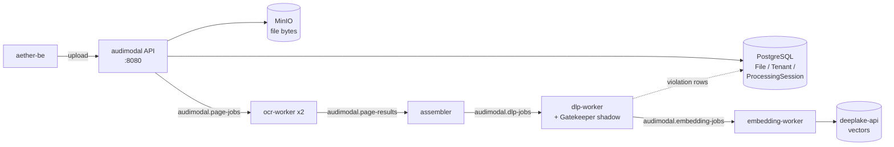

# AudiModal.ai

*Document ingestion and content scanning for the Tributary AI Services (TAS) platform.*

## What this is

AudiModal is the ingestion half of TAS. You give it a file — a scanned contract, a spreadsheet, an email archive — and it turns that file into text, chunks, findings, and vectors that the rest of the platform can search and reason over. Along the way it extracts text (falling back to optical character recognition for scanned pages), splits the document into chunks, scans each chunk for personally identifiable information (PII), generates embeddings, and writes those vectors to the DeepLake service. File bytes live in MinIO; the `File`, `Tenant`, and `ProcessingSession` records that track all of it live in PostgreSQL. Everything is scoped to a tenant.

It is not the user-facing application — that is `aether` and `aether-be`. It is not the vector store; it writes into `deeplake-api` and does not own the index. It is not a model gateway; document text never goes to a language model through this service.

The extractors are one Go package per family:

```console
$ ls -d pkg/readers/*/ | xargs -n1 basename | tr "\n" " "
archive csv email html image json markdown microsoft office pdf rtf text xml
```

## Status & scope

**As of 2026-08-26.** AudiModal runs on the TAS k3s cluster in namespace `aether-be`, alongside the Aether backend and the DeepLake service, as five deployments:

| Deployment | Ready | Image |
|---|---|---|
| `audimodal` (the API server) | 1/1 | `audimodal:tenant-canonical-20260520103052` |
| `audimodal-ocr-worker` | 2/2 | `audimodal:latest` |
| `audimodal-assembler` | 1/1 | `audimodal:latest` |
| `audimodal-dlp-worker` | 1/1 | `audimodal:g6-93f5615` |
| `audimodal-embedding-worker` | 1/1 | `audimodal:latest` |

All five are running and the API server reports healthy. The service has no ingress: it is reachable in-cluster at `audimodal.aether-be:8080` and from outside through NodePort `30084`, so there is no public hostname to hand anyone. The API server image was built on 2026-05-20 and the commit this document was verified against landed on 2026-07-17, so `main` is about two months ahead of what is deployed.

Deployed is not the same as busy. The pipeline is idle: the most recent processing the DLP worker recorded was on 2026-07-17, and a Loki query for audimodal log streams in `aether-be` over the last 30 days returns zero streams — the namespace is in the Alloy collection allowlist, so this reflects silence, not a collection gap. Treat any throughput number you find in this repository as unmeasured.

Four things a newcomer will otherwise get wrong:

**Content scanning records, it does not block.** The data loss prevention (DLP) worker runs with `DLP_SHADOW_SCAN=true`. That wraps AudiModal's own scanner in a Gatekeeper shadow which dual-runs both engines and logs the per-type difference, then returns AudiModal's result unchanged (`pkg/dlp/shadow/scanner.go:1-18`, wired at `cmd/dlpworker/main.go:80`). AudiModal stays authoritative; a Gatekeeper error is logged and swallowed. Nothing Gatekeeper finds is redacted, quarantined, or blocked. The point of the shadow is to size the gap before any cutover — AudiModal's own scanner advertises five pattern types (`pkg/dlp/scanner/basic_scanner.go:150`) against Gatekeeper's much wider set. Here is the worker announcing the shadow and, an hour later, the single diff it recorded that day — this is what "measure-only" looks like in practice:

```text
2026/07/17 20:36:04 [DLPWorker] Gatekeeper shadow scanning ENABLED (log-only diff; audimodal authoritative)
[DLPWorker][gk-shadow] 2026/07/17 21:37:28 dlp-shadow: gatekeeper_only=[aws_access_key:1 aws_secret_key:1 connection_string:1 credit_card:1 private_key:1 sql:1] both(audimodal/gk)=[email:2/2 phone_number:1/1 ssn:1/1]
```

**Authentication is a length check, not verification.** `AuthenticationMiddleware` (`internal/server/middleware.go:150-191`) accepts any `X-API-Key` of 32 characters or more without consulting the database, and accepts any `Authorization: Bearer` header without validating the token — both paths carry a TODO comment saying so. Separately, `/api/v1/tenants` and `/api/v1/tenants/{id}` are registered through a pass-through `noAuthMiddleware` (`internal/server/server.go:373-389`), so tenant metadata is readable with no header at all. Do not put untrusted traffic in front of this.

**The enterprise connectors and the sync framework are unreachable code.** `pkg/connectors/` contains packages for Box, Confluence, Dropbox, Google Drive, Notion, OneDrive, SharePoint, and Slack. No file in this repository imports `pkg/connectors`. `pkg/sync` is imported only by `internal/api/sync_controller.go`, which is itself imported by nothing under `cmd/`. They compile; no running process can reach them. `ROADMAP.md` marks both categories 100% complete, along with "Authentication ✅ Complete 100%" — that file has not been maintained and should not be used to judge status.

**CI is red, and was already red before you got here.** The twelve most recent workflow runs — Tests and CI/CD Pipeline, on `main` and on pull requests, the newest from 2026-07-17 — all failed. Tests never reaches a test: it stops at its formatting gate, and `gofmt -s -l .` still reports 37 files at this commit. The job matrix also pins Go 1.22 and 1.23 while `go.mod` requires 1.24, so two of the three legs cannot compile the module. `main` has no branch protection, so a pull request here does not need a green check to merge — and a red check is not evidence that you broke something.

The interface spec in `api/openapi.json` describes 36 paths and 54 operations. Earlier revisions of this page claimed 90 or more endpoints; that number was never true of this spec.

## Quick start

Two paths. The first gets you a build and a test run on a laptop. The second gets you a real response out of the deployed service.

### Build it

A plain build fails, and the error does not name AudiModal:

```console
$ go build ./...
github.com/flier/gohs/internal/hs: exec: "pkg-config": executable file not found in $PATH
```

That is Gatekeeper's scanner reaching for its cgo Hyperscan engine. Select the pure-Go regexp engine with the `nohs` build tag, which is exactly what the Dockerfile does for the DLP worker (`Dockerfile:35`) and what CI sets globally (`.github/workflows/test.yml:12`):

```console
$ go build -tags nohs ./... && echo "build ok"
build ok
```

Gatekeeper is a versioned module requirement, not a sibling `replace` (`go.mod:33`), so the repository builds standalone with nothing checked out next to it.

### Test it

The DLP packages — the part of the tree that changed most recently — pass:

```console
$ go test -tags nohs -count=1 ./pkg/dlp/...
?   	github.com/jscharber/audimodal/pkg/dlp	[no test files]
ok  	github.com/jscharber/audimodal/pkg/dlp/compliance	0.004s
ok  	github.com/jscharber/audimodal/pkg/dlp/patterns	0.008s
?   	github.com/jscharber/audimodal/pkg/dlp/scanner	[no test files]
ok  	github.com/jscharber/audimodal/pkg/dlp/shadow	0.029s
?   	github.com/jscharber/audimodal/pkg/dlp/types	[no test files]
```

The full suite does not. Running the package set the Makefile uses at commit `a96cde3`, with no source changes, 19 packages pass and 4 fail:

```console
$ go test -tags nohs $(go list ./tests/... ./pkg/... ./internal/... | grep -v -E "(cmd/|controllers)") 2>&1 | grep -E '^FAIL\s'
FAIL	github.com/jscharber/audimodal/tests	280.651s
FAIL	github.com/jscharber/audimodal/pkg/preprocessing	0.011s
FAIL	github.com/jscharber/audimodal/pkg/readers/pdf	0.543s
FAIL	github.com/jscharber/audimodal/pkg/readers/pdf/mapreduce	0.427s
```

These failures pre-date this document and are unrelated to it — nothing in the working tree was modified to produce that run. Three of the four have distinct causes worth knowing before you chase them:

- `pkg/readers/pdf/mapreduce/types_test.go:33` asserts defaults that the code no longer has — `got 300, expected 150` for the page-scan resolution, and the same shape for the timeout and the memory ceiling. The test is stale, not the code.
- `pkg/readers/pdf` shells out to poppler and tesseract, which are installed in the runtime image but probably not on your machine: `pdftotext failed: exit status 1`.
- `github.com/jscharber/audimodal/tests` is an integration suite that expects a DeepLake service on the hostname `deeplake-api`: `dial tcp: lookup deeplake-api on 10.255.255.254:53: read udp ... i/o timeout`. CI supplies a WireMock stand-in; locally it will hang for its timeouts and then fail.

`make test-unit` runs the narrower set CI uses first, and is the faster loop.

### Call the deployed service

There is no public hostname, so forward the in-cluster service:

```console
$ kubectl port-forward -n aether-be svc/audimodal 8084:8080
Forwarding from 127.0.0.1:8084 -> 8080
Forwarding from [::1]:8084 -> 8080
```

Health needs no credential. The three checks are the database, process memory, and disk (`internal/server/server.go:74-80`):

```console
$ curl -s http://localhost:8084/health | jq .
{
  "service": "audimodal",
  "status": "healthy",
  "summary": {
    "degraded": 0,
    "healthy": 3,
    "unhealthy": 0,
    "unknown": 0
  },
  "timestamp": "2026-08-26T23:37:48.151111603Z",
  "version": "1.0.0"
}
```

Anything tenant-scoped does need one, and this is the first wall most people hit:

```console
$ curl -s http://localhost:8084/api/v1/tenants/1d644409-fc3d-4036-bbf5-16c869b5b88c/files
Authentication required
```

The credential is an API key sent in the `X-API-Key` header. For the k3s test suite it is `AUDIMODAL_API_KEY`, sourced from `apps/audimodal/api-test.env` in the `aether-secrets` repository (`Makefile:164-174`) — that file is absent there today, so `make test-k3s-with-secrets` currently exits with its own "not found" message. Export the key and the call succeeds:

```console
$ curl -s -H "X-API-Key: $AUDIMODAL_API_KEY" \
    http://localhost:8084/api/v1/tenants/1d644409-fc3d-4036-bbf5-16c869b5b88c/files | jq .
{
  "success": true,
  "data": [],
  "meta": {
    "pagination": {
      "page": 1,
      "page_size": 20,
      "total_pages": 0,
      "total_count": 0,
      "has_next": false,
      "has_prev": false
    },
    "count": 0
  },
  "timestamp": "2026-08-26T23:38:14.625756403Z",
  "request_id": "req_1787787494623870885"
}
```

A key shorter than 32 characters also returns `401`, with the body `Invalid API key` (`internal/server/middleware.go:184-187`); a tenant identifier that is a well-formed UUID but absent from the database returns `404` with the body `Tenant not found`. Because the middleware only measures the key, the capture above was produced with an arbitrary 32-character string — see the authentication note under *Status & scope* before you conclude anything from that.

> [!UNVERIFIED] `docker-compose.yml` brings up the API server and a PostgreSQL container with `AUTH_ENABLED=false` on host port 8084. That path was not exercised for this document; only the Go build, the test runs, and the cluster calls above were.

## How it fits

AudiModal has one synchronous entry point and a four-stage asynchronous pipeline behind it. The API server accepts an upload, stores the bytes, and publishes a job; four worker binaries pass the document along Kafka topics (`pkg/events/kafka_messages.go:9-13`) until vectors land in DeepLake.



The hard dependency is PostgreSQL, at `postgres-shared.tas-shared.svc.cluster.local:5432`. Every tenant-scoped route resolves the tenant through a database lookup before dispatch (`internal/server/middleware.go:195-220`), so with the database unreachable every route below `/api/v1/tenants/{id}/` fails and the `database` health check flips the service to unhealthy.

Kafka is softer than it looks. If the producer cannot connect, the server logs a warning and carries on without it (`internal/server/server.go:352-357`): the API stays up and uploads still get stored, but nothing is queued, so documents sit at rest and never reach the workers. MinIO at `minio-shared.tas-shared.svc.cluster.local:9000` holds the bytes; DeepLake at `deeplake-api:8000` receives the vectors at the end of the chain. Gatekeeper is a linked library, not a service — there is nothing to be up or down.

The dotted arrow is worth one sentence, because it is where scanning becomes durable: for every finding the DLP worker writes a `DLPViolation` row into PostgreSQL, attached to a per-tenant system policy it creates on demand (`cmd/dlpworker/main.go:249-252`, `cmd/dlpworker/main.go:335-360`). That write is where a tenant mismatch between services surfaces, as it did on the last run:

```text
2026/07/17 21:37:28 [DLPWorker] Failed to create system policy for tenant 3ec05a0c-d3df-47b5-8c94-3529c33dab46: ERROR: insert or update on table "dlp_policies" violates foreign key constraint "dlp_policies_tenant_id_fkey" (SQLSTATE 23503)
2026/07/17 21:37:28 [DLPWorker] Chunk 98376802-cb7f-484c-8282-931393c23b3f scanned: pii=true, findings=4, risk=0.85, duration=477ms
```

The scan still ran and the chunk still moved down the pipeline; only the violation rows were dropped, because the job named a tenant that has no row in AudiModal's own `tenants` table.

On the other side, `aether-be` is the caller: it uploads on a user's behalf and reads processing state back. Both live in namespace `aether-be`, and that namespace has no NetworkPolicy objects, so nothing stands between them at the network layer.

## Configuration

Everything is environment variables, read into `internal/server/config.go`. The ones that change behaviour:

| Variable | Default in code | In the deployment | What it does |
|---|---|---|---|
| `SERVER_PORT` | `8080` | not set | The only port variable the loader reads (`internal/server/config.go:17`, `cmd/server/main.go:79`). The manifest sets a shorter, differently-named port variable that nothing reads, so the listener lands on 8080 by default anyway. |
| `AUTH_ENABLED` | `true` | unset, so `true` | When false, the middleware waves everything through. `docker-compose.yml` sets it false. |
| `API_KEY_HEADER` | `X-API-Key` | unset | Header the key is read from. |
| `API_PREFIX` | `/api/v1` | unset | Prefix all routes hang off. |
| `DLP_SHADOW_SCAN` | off | `true` on the DLP worker | Dual-runs Gatekeeper and logs the difference. Record-only. |
| `KAFKA_ENABLED` | — | `true` | Off means uploads are stored but never processed. |
| `DB_AUTO_MIGRATE` | — | `false` | True in `docker-compose.yml`, false in the cluster. |
| `EAI_ENCRYPTION_KEY` | falls back to a hardcoded literal (`internal/server/server.go:336-338`) | unset | Encrypts stored storage-backend credentials. The cluster is running on the fallback. |

The API server container also carries two Go runtime settings, tuned against its 8Gi memory limit and 500m processor limit:

```text
GOGC=20
GOMEMLIMIT=4GiB
```

Secrets are Kubernetes secrets in namespace `aether-be`, referenced here by location only:

- `audimodal-secrets` — keys `db-username`, `db-password`, `minio-access-key`, `minio-secret-key`.
- `postgres-shared-secret` — keys `username`, `password`, used by the API server deployment.
- `aether-backend-secret` — keys `jwt-secret` and `DEEPLAKE_API_KEY`.
- `openai-secret` — key `OPENAI_API_KEY`, used by the embedding path.
- The test API key lives outside the cluster, in the `aether-secrets` repository at `apps/audimodal/api-test.env`.

Server defaults also live in `config/server.yaml`, and the deployment manifests that set all of the above are in `deployments/kubernetes/`.

## Where to go next

- [DEVELOPER.md](./DEVELOPER.md) — build, test, and deploy mechanics in more depth than this page carries.
- [DEVELOPER_DOCUMENTATION.md](./DEVELOPER_DOCUMENTATION.md) — the long-form internals guide.
- [api/openapi.json](./api/openapi.json) — the interface spec, 36 paths. [docs/api/](./docs/api/) has per-area notes including [authentication.md](./docs/api/authentication.md), which describes the intended scheme rather than the one implemented today.
- [docs/architecture/](./docs/architecture/) — design notes for the PDF map-reduce path and the embedding path.
- [KNOWN_ISSUES.md](./KNOWN_ISSUES.md) — tracked defects, including the event-bus data race.
- [deployments/kubernetes/](./deployments/kubernetes/) — the manifests behind the five deployments listed above.
- Entity documentation for `File`, `Tenant`, and `ProcessingSession` lives in the shared repository at `aether-shared/data-models/audimodal/`, with the cross-service upload flow under `aether-shared/data-models/cross-service/flows/`.
- [ROADMAP.md](./ROADMAP.md) — kept for history. Its completion table contradicts the code in at least three places; *Status & scope* above is the current answer.
