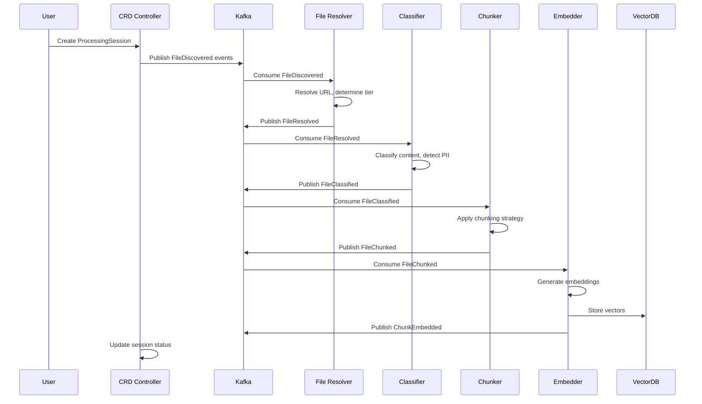

# Document Processing Platform - Final Design Specification (Continued)

### 5. **Multi-Tenant by Design**
- Complete data, compute, and network isolation
- Tenant-specific quotas and resource limits
- Compliance policies per tenant (GDPR, HIPAA, PCI)
- Namespace-based isolation in Kubernetes

---

## URL-Based File Access System

### Supported URL Schemes

```go
// URL scheme examples
file:///path/to/local/file.pdf
s3://bucket-name/path/to/file.pdf
gdrive://1BxiMVs0XRA5nFMdKvBdBZjgmUUqptlbs74OgvE2upms
sharepoint://company.sharepoint.com/sites/hr/Shared%20Documents/file.docx
box://folder/12345/file.xlsx
dropbox://Apps/MyApp/documents/file.pdf
azure://container/path/to/file.json
gcs://bucket/path/to/file.csv
```

### URL Resolver Interface

```go
type URLResolver interface {
    Supports(scheme string) bool
    Resolve(ctx context.Context, fileURL string) (*ResolvedFile, error)
    CreateIterator(ctx context.Context, fileURL string, config map[string]any) (core.ChunkIterator, error)
}

type ResolvedFile struct {
    URL         string            `json:"url"`
    Scheme      string            `json:"scheme"`
    Size        int64             `json:"size"`
    ContentType string            `json:"content_type"`
    Metadata    map[string]string `json:"metadata"`
    AccessInfo  AccessInfo        `json:"access_info"`
}
```

---

## Event-Driven Processing Pipeline

### Event Types and Flow

```yaml
Event Flow:
file.discovered → file.resolved → file.classified → file.chunked → chunk.embedded

Additional Events:
- dlp.violation (when sensitive data detected)
- processing.failed (on errors)
- processing.complete (session completion)
```

### Event Schemas

```go
// File Discovery Event
type FileDiscoveredEvent struct {
    BaseEvent
    Data FileDiscoveredData `json:"data"`
}

type FileDiscoveredData struct {
    URL          string            `json:"url"`
    SourceID     string            `json:"source_id"`
    DiscoveredAt time.Time         `json:"discovered_at"`
    Size         int64             `json:"size"`
    ContentType  string            `json:"content_type"`
    Metadata     map[string]string `json:"metadata"`
}

// File Chunked Event
type FileChunkedEvent struct {
    BaseEvent
    Data FileChunkedData `json:"data"`
}

type FileChunkedData struct {
    URL           string        `json:"url"`
    ChunkCount    int           `json:"chunk_count"`
    Strategy      string        `json:"strategy"`
    ChunkMetadata []ChunkInfo   `json:"chunks"`
}
```

### Kafka Topic Structure

```yaml
Topics:
  file.discovery:
    partitions: 12
    replicas: 3
    retention: 7 days
    
  file.resolved:
    partitions: 12
    replicas: 3
    
  file.classified:
    partitions: 12
    replicas: 3
    
  file.chunked:
    partitions: 24  # Higher for chunking workload
    replicas: 3
    
  chunk.embedded:
    partitions: 24
    replicas: 3
    
  dlp.violations:
    partitions: 6
    replicas: 3
    retention: 1 year  # Compliance requirement
```

---

## Go Plugin Architecture

### Core Interfaces

```go
// Base connector interface
type Connector interface {
    GetConfigSpec() []ConfigSpec
    ValidateConfig(config map[string]any) error
    TestConnection(ctx context.Context, config map[string]any) ConnectionTestResult
    GetType() string
    GetName() string
    GetVersion() string
}

// Data source reader
type DataSourceReader interface {
    Connector
    DiscoverSchema(ctx context.Context, sourcePath string) (SchemaInfo, error)
    EstimateSize(ctx context.Context, sourcePath string) (SizeEstimate, error)
    CreateIterator(ctx context.Context, sourcePath string, strategyConfig map[string]any) (ChunkIterator, error)
    SupportsStreaming() bool
    GetSupportedFormats() []string
}

// Chunking strategy
type ChunkingStrategy interface {
    Connector
    GetRequiredReaderCapabilities() []string
    ConfigureReader(readerConfig map[string]any) (map[string]any, error)
    ProcessChunk(ctx context.Context, rawData any, metadata ChunkMetadata) ([]Chunk, error)
    GetOptimalChunkSize(sourceSchema SchemaInfo) int
    SupportsParallelProcessing() bool
}

// Content discoverer
type DataSourceDiscoverer interface {
    Connector
    AnalyzeSource(ctx context.Context, sourcePath string) (DiscoveryHints, error)
    RecommendStrategies(ctx context.Context, schema SchemaInfo, hints DiscoveryHints, requirements map[string]any) ([]RecommendedStrategy, error)
    GetSupportedSourceTypes() []string
}
```

### Plugin Registry

```go
type Registry struct {
    readers     map[string]func() DataSourceReader
    strategies  map[string]func() ChunkingStrategy  
    discoverers map[string]func() DataSourceDiscoverer
}

// Auto-registration pattern
func init() {
    registry.GlobalRegistry.RegisterReader("csv", NewCSVReader)
    registry.GlobalRegistry.RegisterStrategy("sentence_chunking", NewSentenceChunking)
    registry.GlobalRegistry.RegisterDiscoverer("text_analyzer", NewTextAnalyzer)
}
```

### Available Strategies

```yaml
Text Strategies:
  - sentence_chunking: Natural sentence boundaries
  - paragraph_chunking: Paragraph-based splits
  - semantic_chunking: Topic boundary detection
  - sliding_window: Overlapping content windows

Structured Strategies:
  - column_grouping: Group related columns
  - row_batching: Process in row batches
  - relational_chunking: Follow FK relationships
  - temporal_chunking: Time-series windows

Compliance Strategies:
  - gdpr_chunking: Privacy-preserving chunking
  - hipaa_chunking: Healthcare compliance
  - pci_chunking: Payment data handling

Hybrid Strategies:
  - adaptive_chunking: Dynamic strategy selection
  - multi_modal_chunking: Mixed content types
```

---

## Kubernetes CRD Integration

### Core CRDs

#### Tenant CRD
```yaml
apiVersion: docprocessing.io/v1
kind: Tenant
metadata:
  name: enterprise-corp
spec:
  displayName: "Enterprise Corp Inc."
  billing:
    plan: enterprise
    billingEmail: billing@enterprise-corp.com
  quotas:
    filesPerHour: 10000
    storageGB: 1000
    computeHours: 100
    apiRequestsPerMinute: 5000
    maxConcurrentJobs: 50
  compliance:
    gdpr: true
    hipaa: true
    dataResidency: ["eu", "us"]
  contactInfo:
    adminEmail: admin@enterprise-corp.com
    securityEmail: security@enterprise-corp.com
```

#### DataSource CRD
```yaml
apiVersion: docprocessing.io/v1
kind: DataSource
metadata:
  name: s3-documents
  namespace: tenant-enterprise-corp
spec:
  tenantRef: enterprise-corp
  type: s3
  displayName: "S3 Document Repository"
  config:
    bucket: enterprise-docs
    region: us-east-1
    path: documents/
  credentials:
    secretRef:
      name: s3-credentials
      namespace: tenant-enterprise-corp
  syncSettings:
    enabled: true
    schedule: "0 */6 * * *"  # Every 6 hours
    incrementalSync: true
  processing:
    autoClassify: true
    dlpScanEnabled: true
    embeddingTypes: ["text", "table"]
    chunkingStrategy: "auto"
```

#### ProcessingSession CRD
```yaml
apiVersion: docprocessing.io/v1
kind: ProcessingSession
metadata:
  name: quarterly-reports-session
  namespace: tenant-enterprise-corp
spec:
  tenantRef: enterprise-corp
  files:
    - url: "s3://enterprise-docs/reports/q4-2024/"
      size: 524288000
      type: "application/pdf"
    - url: "gdrive://1BxiMVs0XRA5nFMdKvBdBZjgmUUqptlbs74OgvE2upms"
      size: 1048576
      type: "application/vnd.google-apps.spreadsheet"
  options:
    chunkingStrategy: "semantic_chunking"
    embeddingTypes: ["text"]
    dlpScanEnabled: true
    priority: "high"
```

#### DLP Policy CRD
```yaml
apiVersion: docprocessing.io/v1
kind: DLPPolicy
metadata:
  name: gdpr-compliance
  namespace: tenant-enterprise-corp
spec:
  tenantRef: enterprise-corp
  displayName: "GDPR Compliance Policy"
  enabled: true
  priority: 90
  contentRules:
    - name: "ssn-detection"
      type: "regex"
      pattern: '\b\d{3}-?\d{2}-?\d{4}\b'
      sensitivity: "high"
    - name: "email-detection"
      type: "regex"
      pattern: '\b[A-Za-z0-9._%+-]+@[A-Za-z0-9.-]+\.[A-Z|a-z]{2,}\b'
      sensitivity: "medium"
  actions:
    - type: "encrypt"
    - type: "alert"
      notifyRoles: ["data-protection-officer"]
    - type: "audit"
```

---

## Project Structure

```
document-processing-platform/
├── api/v1/                          # Kubernetes API definitions
├── pkg/                             # Public API packages
│   ├── core/                        # Core interfaces
│   ├── urls/                        # URL resolution system
│   │   └── schemes/                 # URL scheme implementations
│   ├── events/                      # Event system
│   ├── registry/                    # Plugin registry
│   ├── strategies/                  # Chunking strategies
│   │   ├── text/
│   │   ├── structured/
│   │   ├── compliance/
│   │   └── hybrid/
│   ├── readers/                     # Data source readers
│   │   ├── csv/
│   │   ├── json/
│   │   ├── pdf/
│   │   └── database/
│   ├── discovery/                   # Content discovery
│   ├── classification/              # Data classification
│   └── observability/               # Monitoring & tracing
├── internal/                        # Private packages
│   ├── processors/                  # Event processors
│   ├── security/dlp/                # DLP engine
│   └── database/                    # Database layer
├── controllers/                     # Kubernetes controllers
├── cmd/                             # Main applications
│   ├── server/                      # API server
│   ├── controller/                  # CRD controller
│   ├── processor/                   # Event processor
│   └── cli/                         # CLI tool
├── config/                          # Kubernetes manifests
├── examples/                        # Usage examples
├── deployments/                     # Deployment configs
└── scripts/                         # Development scripts
```

---

## Key Interfaces and Components

### URL Resolution Flow
```go
// 1. Parse URL and get resolver
resolver := urlRegistry.GetResolver("s3://bucket/file.pdf")

// 2. Resolve file metadata
resolved, err := resolver.Resolve(ctx, fileURL)

// 3. Create iterator for processing
iterator, err := resolver.CreateIterator(ctx, fileURL, strategyConfig)

// 4. Process chunks
for {
    chunk, err := iterator.Next(ctx)
    if err == io.EOF { break }
    
    // Process chunk...
}
```

### Event Processing Flow
```go
// 1. Producer publishes events
event := FileDiscoveredEvent{...}
producer.Publish("file.discovery", event)

// 2. Consumer processes events
consumer.Subscribe("file.discovery", func(event FileDiscoveredEvent) {
    // Resolve file URL
    resolved := urlRegistry.Resolve(event.Data.URL)
    
    // Publish next event
    resolvedEvent := FileResolvedEvent{...}
    producer.Publish("file.resolved", resolvedEvent)
})
```

### Plugin Strategy Selection
```go
// Auto-select strategy based on file type and compliance
strategy := registry.GetComplianceStrategy(tenantID, fileType)

// Or use discovery recommendations
discoverer := registry.GetDiscoverer("content_analyzer")
recommendations := discoverer.RecommendStrategies(schema, hints, requirements)
strategy := registry.GetStrategy(recommendations[0].StrategyType)
```

---

## Processing Flow

### Complete File Processing Pipeline



### Processing Tiers

```yaml
Tier 1 (< 10MB):
  - Fast processing
  - In-memory operations
  - Sentence/paragraph chunking
  - Low latency

Tier 2 (10MB - 1GB):
  - Balanced processing
  - Streaming where needed
  - Structured data chunking
  - Medium latency

Tier 3 (> 1GB):
  - Memory-efficient processing
  - Full streaming required
  - Batch chunking
  - Higher latency acceptable
```

---

## Configuration and Deployment

### Helm Chart Values
```yaml
# values.yaml
global:
  registry: your-registry.com
  environment: production

controller:
  replicaCount: 3
  image:
    repository: document-processing-controller
    tag: "latest"

processors:
  fileResolver:
    replicaCount: 5
    kafkaConsumerGroup: "file-resolver"
  
  chunker:
    replicaCount: 10
    kafkaConsumerGroup: "chunker"

kafka:
  topics:
    file.discovery:
      partitions: 12
      replicas: 3
    file.chunked:
      partitions: 24
      replicas: 3

monitoring:
  prometheus: true
  grafana: true
  alerts:
    - dlp-violations
    - quota-exceeded
    - processing-failures
```

### Environment Configuration
```yaml
# config.yaml
kubernetes:
  namespace: document-processing-system
  leader_election: true

kafka:
  brokers:
    - kafka-bootstrap.document-processing.svc.cluster.local:9092
  security_protocol: SASL_SSL

database:
  host: postgresql.document-processing.svc.cluster.local
  database: document_processing

observability:
  jaeger_endpoint: http://jaeger-collector:14268/api/traces
  prometheus_port: 9090
  log_level: info

processing:
  tiers:
    tier1:
      max_file_size: 10MB
      max_concurrent: 50
    tier2:
      max_file_size: 1GB
      max_concurrent: 20
    tier3:
      max_file_size: 10GB
      max_concurrent: 5
```

---

## Examples and Usage

### Basic File Processing
```go
// Process a single file
session := &ProcessingSession{
    Files: []FileSpec{
        {
            URL:  "s3://my-bucket/document.pdf",
            Type: "application/pdf",
        },
    },
    Options: ProcessingOptions{
        ChunkingStrategy: "semantic_chunking",
        EmbeddingTypes:   []string{"text"},
        DLPScanEnabled:   true,
    },
}

// Submit for processing
client.Create(ctx, session)
```

### Multi-Tenant Setup
```yaml
# Enterprise tenant with GDPR compliance
apiVersion: docprocessing.io/v1
kind: Tenant
metadata:
  name: enterprise-eu
spec:
  compliance:
    gdpr: true
    dataResidency: ["eu"]
  quotas:
    filesPerHour: 5000
    storageGB: 500
```

### Custom Plugin Development
```go
// Custom PDF reader
type CustomPDFReader struct {
    config map[string]any
}

func (r *CustomPDFReader) CreateIterator(ctx context.Context, url string, config map[string]any) (ChunkIterator, error) {
    // Custom PDF processing logic
    return NewCustomPDFIterator(url, config), nil
}

// Register plugin
func init() {
    registry.GlobalRegistry.RegisterReader("custom_pdf", NewCustomPDFReader)
}
```

---

## Development Setup

### Quick Start
```bash
# 1. Install Go and tools
./scripts/install-go.sh
./scripts/setup-dev.sh

# 2. Initialize project
make generate
make manifests

# 3. Start local development
scripts/deploy-local.sh

# 4. Run tests
make test
make test-integration
```

### Development Commands
```bash
# Generate CRDs
make manifests

# Build images
make docker-build

# Deploy to local cluster
make deploy

# Run processors locally
go run cmd/processor/main.go

# Test with sample files
kubectl apply -f examples/basic/
```

### Testing Strategy
```yaml
Unit Tests:
  - Interface implementations
  - Plugin registration
  - Event serialization
  - URL resolution

Integration Tests:
  - End-to-end processing
  - Kafka event flow
  - CRD controllers
  - Multi-tenant isolation

Performance Tests:
  - File processing throughput
  - Memory usage patterns
  - Concurrent processing limits
  - Large file handling
```

---

## Key Benefits and Features

### Scalability
- **Horizontal scaling** through Kafka partitions and consumer groups
- **Processing tiers** for optimal resource utilization
- **Plugin architecture** for extensible functionality
- **Event-driven design** prevents blocking operations

### Multi-Tenancy
- **Complete isolation** at data, compute, and network levels
- **Compliance enforcement** through policy CRDs
- **Resource quotas** prevent tenant interference
- **Audit trails** for regulatory requirements

### Developer Experience
- **URL-first design** simplifies file access across all systems
- **Plugin interfaces** enable easy extension
- **Kubernetes-native** leverages existing operational knowledge
- **Event observability** provides complete processing visibility

### Production Ready
- **GitOps workflow** for configuration management
- **Health checks** and monitoring integration
- **Graceful degradation** with tier-based processing
- **Security by design** with encryption and DLP

This architecture provides a robust, scalable, and extensible document processing platform that can handle enterprise-scale workloads while maintaining security, compliance, and operational excellence.
