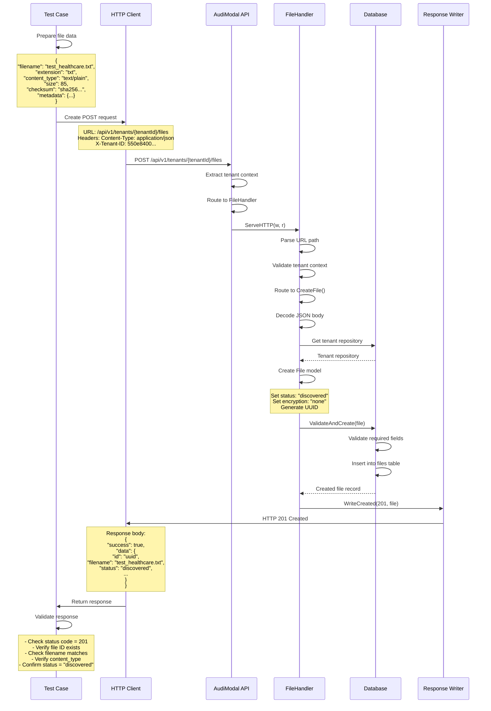

# Test Case: Create Text File Record

## Overview
This test validates the creation of a file record in the system for a text document.

## Call Flow



## Request Details

### Endpoint
```
POST /api/v1/tenants/9855e094-36a6-4d3a-a4f5-d77da4614439/files
```

### Headers
```
Content-Type: application/json
X-Tenant-ID: 9855e094-36a6-4d3a-a4f5-d77da4614439
```

### Request Body
```json
{
  "filename": "test_healthcare.txt",
  "extension": "txt",
  "content_type": "text/plain",
  "size": 85,
  "checksum": "8f7d3e4b2a1c9f6e5d4c3b2a1f0e9d8c7b6a5f4e3d2c1b0a9f8e7d6c5b4a3f2e",
  "checksum_type": "sha256",
  "path": "/uploads/test_healthcare.txt",
  "metadata": {
    "category": "healthcare",
    "language": "en"
  }
}
```

## Response Details

### Success Response (201 Created)
```json
{
  "success": true,
  "data": {
    "id": "b14386f8-ba48-4c6b-acc7-2ba641ac21eb",
    "tenant_id": "9855e094-36a6-4d3a-a4f5-d77da4614439",
    "filename": "test_healthcare.txt",
    "extension": "txt",
    "content_type": "text/plain",
    "size": 85,
    "checksum": "8f7d3e4b2a1c9f6e5d4c3b2a1f0e9d8c7b6a5f4e3d2c1b0a9f8e7d6c5b4a3f2e",
    "checksum_type": "sha256",
    "path": "/uploads/test_healthcare.txt",
    "status": "discovered",
    "encryption_status": "none",
    "metadata": {
      "category": "healthcare",
      "language": "en"
    },
    "created_at": "2025-08-14T10:30:00Z",
    "updated_at": "2025-08-14T10:30:00Z"
  },
  "timestamp": "2025-08-14T10:30:00Z",
  "request_id": "req_123456789"
}
```

## Key Implementation Details

1. **Tenant Context**: The handler extracts tenant context from the request context
2. **URL Parsing**: The handler parses the URL to identify the resource and action
3. **File Status**: New files are created with status "discovered"
4. **Encryption**: Default encryption status is "none"
5. **Validation**: The database layer validates required fields before insertion
6. **Response Format**: Uses standard API response wrapper with success flag and data

## Test Validations

1. **Status Code**: Verify HTTP 201 Created
2. **File ID**: Check that a UUID is generated
3. **Field Matching**: Ensure response fields match request
4. **Default Values**: Verify status="discovered" and encryption_status="none"
5. **Metadata Preservation**: Confirm metadata is stored correctly

## Notes

- The actual file content is not uploaded in this endpoint
- This creates a file record only; actual file processing happens separately
- The file can be linked to a data source or processing session via optional IDs
- The checksum should be calculated from the actual file content when available