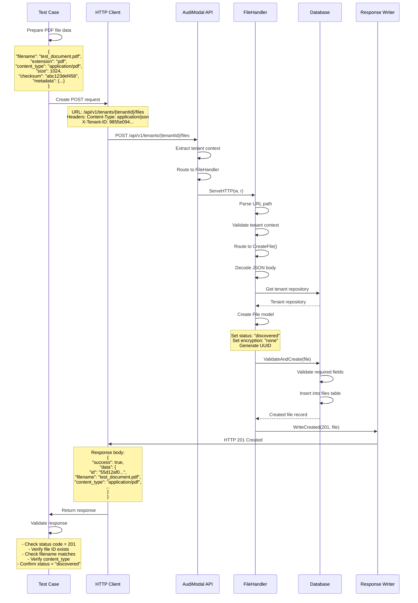

# Test Case: Create PDF File Record

## Overview
This test validates the creation of a file record in the system for a PDF document.

## Call Flow



## Request Details

### Endpoint
```
POST /api/v1/tenants/9855e094-36a6-4d3a-a4f5-d77da4614439/files
```

### Headers
```
Content-Type: application/json
X-Tenant-ID: 9855e094-36a6-4d3a-a4f5-d77da4614439
```

### Request Body
```json
{
  "filename": "test_document.pdf",
  "extension": "pdf",
  "content_type": "application/pdf",
  "size": 1024,
  "checksum": "abc123def456",
  "checksum_type": "sha256",
  "metadata": {
    "category": "research",
    "author": "Test Author"
  }
}
```

## Response Details

### Success Response (201 Created)
```json
{
  "success": true,
  "data": {
    "id": "55d12af0-e749-4b0f-953f-9be0dfeab477",
    "tenant_id": "9855e094-36a6-4d3a-a4f5-d77da4614439",
    "filename": "test_document.pdf",
    "extension": "pdf",
    "content_type": "application/pdf",
    "size": 1024,
    "checksum": "abc123def456",
    "checksum_type": "sha256",
    "status": "discovered",
    "encryption_status": "none",
    "metadata": {
      "category": "research",
      "author": "Test Author"
    },
    "created_at": "2025-08-14T01:09:00Z",
    "updated_at": "2025-08-14T01:09:00Z"
  },
  "timestamp": "2025-08-14T01:09:00Z",
  "request_id": "req_123456789"
}
```

## Key Implementation Details

1. **PDF File Type**: The system correctly handles PDF MIME type (`application/pdf`)
2. **Metadata Support**: Custom metadata fields like "category" and "author" are preserved
3. **File Extension**: The "pdf" extension is properly stored and validated
4. **Checksum**: Static checksum is accepted (in real scenarios this would be calculated from file content)
5. **Size Tracking**: File size in bytes is recorded for storage management

## Test Validations

1. **Status Code**: Verify HTTP 201 Created
2. **File ID**: Check that a UUID is generated
3. **PDF Content Type**: Ensure `application/pdf` is correctly stored
4. **Extension**: Verify "pdf" extension is preserved
5. **Metadata Preservation**: Confirm custom metadata (category, author) is stored
6. **Default Values**: Verify status="discovered" and encryption_status="none"

## Differences from Text File Test

- **Content Type**: `application/pdf` vs `text/plain`
- **File Extension**: `pdf` vs `txt`
- **Size**: 1024 bytes (larger than text example)
- **Metadata**: Includes "author" field typical for document files
- **Checksum**: Uses static value for testing (would be PDF content hash in production)

## Notes

- PDF files are treated the same as other file types in the metadata system
- The API doesn't validate PDF structure - it only stores metadata
- In production, the checksum should be calculated from actual PDF content
- The system can handle various document types with appropriate MIME types
- Metadata fields are flexible and can accommodate document-specific information