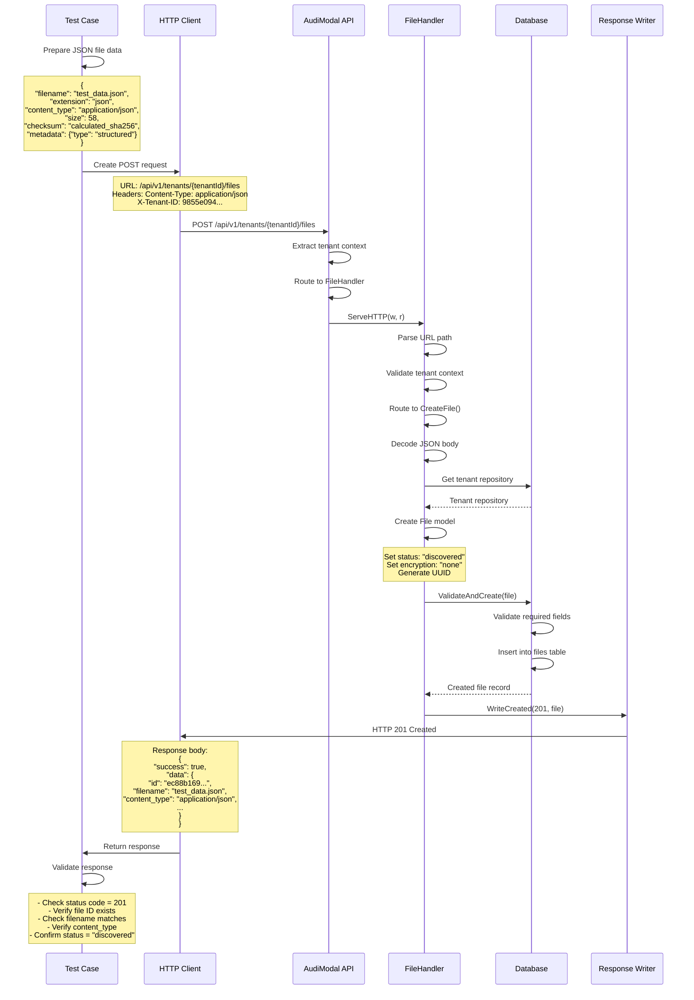

# Test Case: Create JSON File Record

## Overview
This test validates the creation of a file record in the system for a JSON structured data file.

## Call Flow



## Request Details

### Endpoint
```
POST /api/v1/tenants/9855e094-36a6-4d3a-a4f5-d77da4614439/files
```

### Headers
```
Content-Type: application/json
X-Tenant-ID: 9855e094-36a6-4d3a-a4f5-d77da4614439
```

### Request Body
```json
{
  "filename": "test_data.json",
  "extension": "json",
  "content_type": "application/json",
  "size": 58,
  "checksum": "a7b8c9d0e1f2a3b4c5d6e7f8a9b0c1d2e3f4a5b6c7d8e9f0a1b2c3d4e5f6a7b8",
  "checksum_type": "sha256",
  "metadata": {
    "type": "structured"
  }
}
```

### Sample JSON Content (for checksum calculation)
```json
{"title": "Test Data", "content": "Machine learning applications"}
```

## Response Details

### Success Response (201 Created)
```json
{
  "success": true,
  "data": {
    "id": "ec88b169-6a95-4351-956e-004185ae5f14",
    "tenant_id": "9855e094-36a6-4d3a-a4f5-d77da4614439",
    "filename": "test_data.json",
    "extension": "json",
    "content_type": "application/json",
    "size": 58,
    "checksum": "a7b8c9d0e1f2a3b4c5d6e7f8a9b0c1d2e3f4a5b6c7d8e9f0a1b2c3d4e5f6a7b8",
    "checksum_type": "sha256",
    "status": "discovered",
    "encryption_status": "none",
    "metadata": {
      "type": "structured"
    },
    "created_at": "2025-08-14T01:10:00Z",
    "updated_at": "2025-08-14T01:10:00Z"
  },
  "timestamp": "2025-08-14T01:10:00Z",
  "request_id": "req_123456790"
}
```

## Key Implementation Details

1. **JSON File Type**: The system correctly handles JSON MIME type (`application/json`)
2. **Structured Data**: JSON files are flagged as "structured" type in metadata
3. **Calculated Checksum**: Uses SHA256 hash of actual JSON content
4. **Small File Size**: 58 bytes demonstrates handling of compact structured data
5. **File Extension**: The "json" extension is properly stored and validated

## Test Validations

1. **Status Code**: Verify HTTP 201 Created
2. **File ID**: Check that a UUID is generated
3. **JSON Content Type**: Ensure `application/json` is correctly stored
4. **Extension**: Verify "json" extension is preserved
5. **Metadata Preservation**: Confirm "type": "structured" metadata is stored
6. **Checksum Calculation**: Verify SHA256 checksum matches expected value
7. **Default Values**: Verify status="discovered" and encryption_status="none"

## Differences from Previous Tests

- **Content Type**: `application/json` (structured data format)
- **File Extension**: `json` (data format)
- **Size**: 58 bytes (small, compact data)
- **Metadata**: Includes "type": "structured" indicating data nature
- **Checksum**: Calculated from actual JSON content string

## Use Cases for JSON Files

1. **Configuration Data**: Application settings, parameters
2. **API Responses**: Stored API response data
3. **Structured Logs**: Log entries in JSON format
4. **Data Exports**: Exported data from databases or systems
5. **ML Training Data**: Machine learning datasets in JSON format

## Notes

- JSON files are treated as structured data in the system
- The checksum is calculated from the JSON string content
- Metadata can indicate the purpose or type of structured data
- JSON files are suitable for further processing by ML/AI systems
- The API doesn't validate JSON structure - it only stores metadata
- In production, JSON content could be parsed and indexed for search