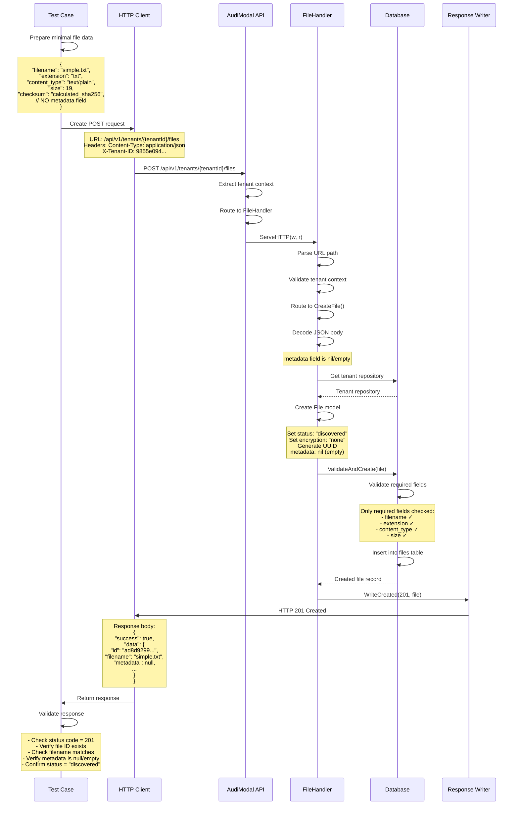

# Test Case: Create File Record Without Metadata

## Overview
This test validates the creation of a file record with only required fields, demonstrating the minimum data needed and how the system handles files without additional metadata.

## Call Flow



## Request Details

### Endpoint
```
POST /api/v1/tenants/9855e094-36a6-4d3a-a4f5-d77da4614439/files
```

### Headers
```
Content-Type: application/json
X-Tenant-ID: 9855e094-36a6-4d3a-a4f5-d77da4614439
```

### Request Body
```json
{
  "filename": "simple.txt",
  "extension": "txt",
  "content_type": "text/plain",
  "size": 19,
  "checksum": "ef92b778b5d8f4e9c7a3b1f6d2e8c5a9b4f7e0d3c6b9a2f5e8d1c4b7a0f3e6d9",
  "checksum_type": "sha256"
}
```

### Sample Content (for checksum calculation)
```
Simple text content
```

## Response Details

### Success Response (201 Created)
```json
{
  "success": true,
  "data": {
    "id": "ad8d9299-d227-4666-9b7a-8ec394ef27ca",
    "tenant_id": "9855e094-36a6-4d3a-a4f5-d77da4614439",
    "filename": "simple.txt",
    "extension": "txt",
    "content_type": "text/plain",
    "size": 19,
    "checksum": "ef92b778b5d8f4e9c7a3b1f6d2e8c5a9b4f7e0d3c6b9a2f5e8d1c4b7a0f3e6d9",
    "checksum_type": "sha256",
    "status": "discovered",
    "encryption_status": "none",
    "metadata": null,
    "created_at": "2025-08-14T01:11:00Z",
    "updated_at": "2025-08-14T01:11:00Z"
  },
  "timestamp": "2025-08-14T01:11:00Z",
  "request_id": "req_123456791"
}
```

## Key Implementation Details

1. **Minimum Required Fields**: Only essential file information is provided
2. **Metadata Handling**: System gracefully handles missing metadata field
3. **Default Values**: Standard defaults are still applied (status, encryption)
4. **Validation**: Required field validation still enforced
5. **Null Metadata**: Response shows `metadata: null` when not provided

## Required vs Optional Fields

### Required Fields ✅
- `filename` - Name of the file
- `extension` - File extension 
- `content_type` - MIME type
- `size` - File size in bytes

### Optional Fields ⭕
- `checksum` - File integrity hash
- `checksum_type` - Hash algorithm used
- `metadata` - Additional custom data
- `data_source_id` - Associated data source
- `processing_session_id` - Processing session link
- `url` - File location URL
- `path` - File system path

## Test Validations

1. **Status Code**: Verify HTTP 201 Created
2. **File ID**: Check that a UUID is generated
3. **Required Fields**: Ensure all required fields are preserved
4. **Metadata Null**: Verify metadata field is null in response
5. **Default Values**: Verify status="discovered" and encryption_status="none"
6. **No Errors**: Confirm no validation errors for missing optional fields

## Differences from Previous Tests

- **No Metadata**: metadata field is completely omitted from request
- **Minimal Data**: Only essential file tracking information
- **Response Metadata**: Shows `metadata: null` instead of object
- **Validation**: Still passes validation with only required fields

## Use Cases for Files Without Metadata

1. **Bulk Imports**: Mass file ingestion where metadata isn't initially available
2. **Legacy Systems**: Importing files from systems without rich metadata
3. **Simple Tracking**: Basic file presence tracking without categorization
4. **Temporary Files**: Files that don't need detailed classification
5. **System Files**: Internal files that don't require user metadata

## Notes

- The API gracefully handles missing metadata without errors
- Required field validation is enforced regardless of metadata presence
- Default system values (status, encryption) are still applied
- Metadata can be added later via update operations
- This demonstrates the API's flexibility for different use cases
- Missing metadata doesn't impact file processing capabilities