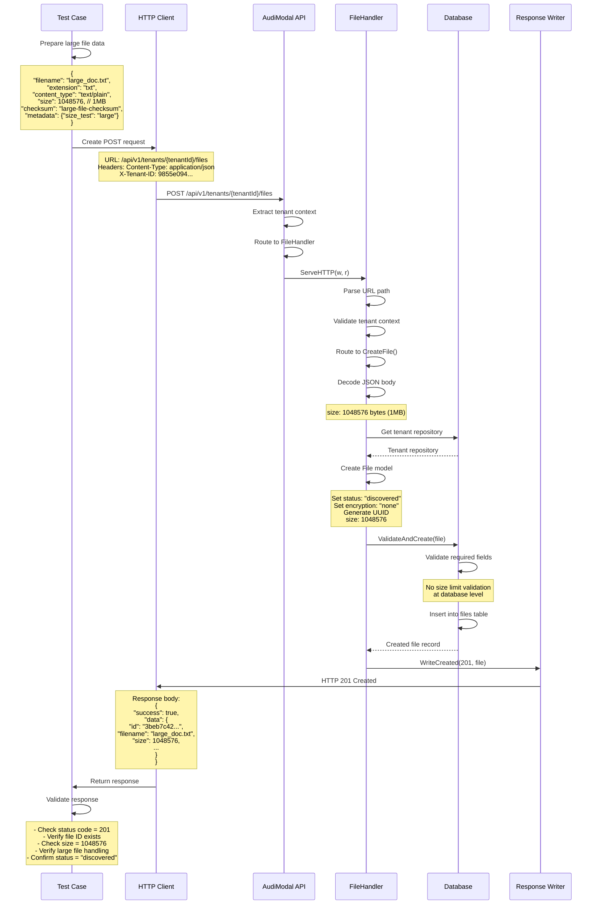

# Test Case: Create Large File Record

## Overview
This test validates the creation of a file record for a large file (1MB), demonstrating how the system handles size limits and large file metadata tracking.

## Call Flow



## Request Details

### Endpoint
```
POST /api/v1/tenants/9855e094-36a6-4d3a-a4f5-d77da4614439/files
```

### Headers
```
Content-Type: application/json
X-Tenant-ID: 9855e094-36a6-4d3a-a4f5-d77da4614439
```

### Request Body
```json
{
  "filename": "large_doc.txt",
  "extension": "txt",
  "content_type": "text/plain",
  "size": 1048576,
  "checksum": "large-file-checksum",
  "checksum_type": "sha256",
  "metadata": {
    "size_test": "large"
  }
}
```

### File Size Details
- **Size**: 1,048,576 bytes (1 MB)
- **Purpose**: Test large file handling
- **Category**: Large document processing

## Response Details

### Success Response (201 Created)
```json
{
  "success": true,
  "data": {
    "id": "3beb7c42-1f71-456a-827d-4f2f9f50aab3",
    "tenant_id": "9855e094-36a6-4d3a-a4f5-d77da4614439",
    "filename": "large_doc.txt",
    "extension": "txt",
    "content_type": "text/plain",
    "size": 1048576,
    "checksum": "large-file-checksum",
    "checksum_type": "sha256",
    "status": "discovered",
    "encryption_status": "none",
    "metadata": {
      "size_test": "large"
    },
    "created_at": "2025-08-14T01:12:00Z",
    "updated_at": "2025-08-14T01:12:00Z"
  },
  "timestamp": "2025-08-14T01:12:00Z",
  "request_id": "req_123456792"
}
```

## Key Implementation Details

1. **Large File Support**: System accepts 1MB file without size restrictions
2. **Size Tracking**: File size is stored as integer (1048576 bytes)
3. **No Size Limits**: API doesn't enforce file size limits at record level
4. **Metadata Tagging**: Large files can be tagged for special handling
5. **Performance**: Large file metadata creation performs normally

## Test Validations

1. **Status Code**: Verify HTTP 201 Created
2. **File ID**: Check that a UUID is generated
3. **Size Preservation**: Ensure exact size (1048576) is stored
4. **Large File Metadata**: Verify "size_test": "large" metadata
5. **No Size Errors**: Confirm no validation errors for large size
6. **Response Time**: Ensure reasonable performance for large file metadata

## Size Comparison with Other Tests

| Test Case | File Size | Notes |
|-----------|-----------|--------|
| Text File | 85 bytes | Small text content |
| PDF File | 1,024 bytes | Medium document |
| JSON File | 58 bytes | Small structured data |
| No Metadata | 19 bytes | Minimal content |
| **Large File** | **1,048,576 bytes** | **1MB large document** |

## Large File Considerations

### Storage Impact
- **Database**: Only metadata stored (negligible impact)
- **Actual Storage**: File content stored separately
- **Indexing**: May require special handling for large content
- **Processing**: Could require chunking strategies

### Processing Implications
1. **Memory Usage**: Large files may need streaming processing
2. **Embedding Generation**: Might require text chunking
3. **Search Indexing**: May need segmented indexing
4. **Network Transfer**: Could require resumable uploads

## Use Cases for Large Files

1. **Documents**: Large PDFs, presentations, reports
2. **Data Files**: CSV exports, database dumps
3. **Media Files**: Images, audio (if supported)
4. **Archive Files**: ZIP, compressed documents
5. **Log Files**: System logs, application logs

## Notes

- The API handles large file metadata without size restrictions
- Actual file content is not uploaded through this endpoint
- Large files might require special processing considerations
- Metadata tagging helps identify files needing special handling
- Size is stored as integer - supports files up to several GB
- Production systems should consider storage and processing limits
- Large file processing may benefit from chunking strategies