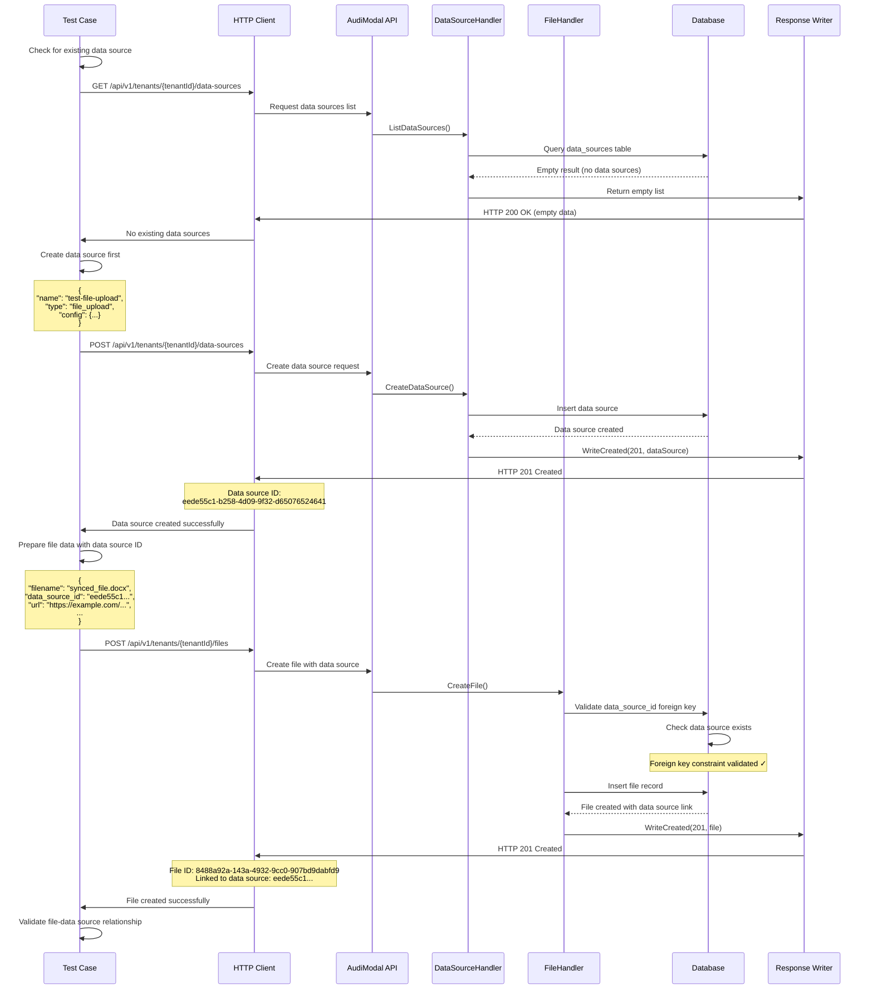

# Test Case: Create File Record with Data Source

## Overview
This test validates the creation of a file record that is associated with a data source, demonstrating the relationship between files and their originating data sources.

## Call Flow



## Request Details

### Step 1: Check Existing Data Sources
```
GET /api/v1/tenants/9855e094-36a6-4d3a-a4f5-d77da4614439/data-sources
```

### Step 2: Create Data Source
```
POST /api/v1/tenants/9855e094-36a6-4d3a-a4f5-d77da4614439/data-sources
```

**Headers:**
```
Content-Type: application/json
X-Tenant-ID: 9855e094-36a6-4d3a-a4f5-d77da4614439
```

**Request Body:**
```json
{
  "name": "test-file-upload",
  "display_name": "Test File Upload Data Source",
  "type": "file_upload",
  "config": {
    "upload_path": "/uploads",
    "max_file_size": 10485760
  },
  "credentials_ref": {},
  "sync_settings": {
    "enabled": true,
    "schedule": "manual"
  },
  "processing_settings": {
    "auto_process": true,
    "chunk_size": 1000
  }
}
```

### Step 3: Create File with Data Source
```
POST /api/v1/tenants/9855e094-36a6-4d3a-a4f5-d77da4614439/files
```

**Headers:**
```
Content-Type: application/json
X-Tenant-ID: 9855e094-36a6-4d3a-a4f5-d77da4614439
```

**Request Body:**
```json
{
  "filename": "synced_file.docx",
  "extension": "docx",
  "content_type": "application/vnd.openxmlformats-officedocument.wordprocessingml.document",
  "size": 2048,
  "checksum": "synced-file-checksum",
  "checksum_type": "sha256",
  "data_source_id": "eede55c1-b258-4d09-9f32-d65076524641",
  "url": "https://example.com/files/document.docx"
}
```

## Response Details

### Data Source Creation Response (201 Created)
```json
{
  "success": true,
  "data": {
    "id": "eede55c1-b258-4d09-9f32-d65076524641",
    "tenant_id": "9855e094-36a6-4d3a-a4f5-d77da4614439",
    "name": "test-file-upload",
    "display_name": "Test File Upload Data Source",
    "type": "file_upload",
    "status": "active",
    "last_sync_status": "pending",
    "config": {
      "upload_path": "/uploads",
      "max_file_size": 10485760
    },
    "created_at": "2025-08-14T01:20:00Z",
    "updated_at": "2025-08-14T01:20:00Z"
  }
}
```

### File Creation Response (201 Created)
```json
{
  "success": true,
  "data": {
    "id": "8488a92a-143a-4932-9cc0-907bd9dabfd9",
    "tenant_id": "9855e094-36a6-4d3a-a4f5-d77da4614439",
    "data_source_id": "eede55c1-b258-4d09-9f32-d65076524641",
    "filename": "synced_file.docx",
    "extension": "docx",
    "content_type": "application/vnd.openxmlformats-officedocument.wordprocessingml.document",
    "size": 2048,
    "checksum": "synced-file-checksum",
    "checksum_type": "sha256",
    "url": "https://example.com/files/document.docx",
    "status": "discovered",
    "encryption_status": "none",
    "created_at": "2025-08-14T01:20:01Z",
    "updated_at": "2025-08-14T01:20:01Z"
  }
}
```

## Key Implementation Details

1. **Foreign Key Relationship**: Files can reference data sources via `data_source_id`
2. **Data Source Creation**: Must create data source before referencing it in files
3. **File Types**: Supports various file types including Office documents (.docx)
4. **URL Storage**: Files can store their original URL location
5. **Sync Workflow**: Files linked to data sources support synchronized processing

## Database Relationships

### Data Sources Table
- **Primary Key**: `id` (UUID)
- **Tenant Scoped**: `tenant_id` links to tenants
- **Type Support**: `file_upload`, `sharepoint`, `google_drive`, etc.
- **Configuration**: JSON config for type-specific settings

### Files Table
- **Foreign Key**: `data_source_id` → `data_sources.id`
- **Constraint**: Data source must exist before file creation
- **Optional**: Files can exist without data source (`data_source_id` can be NULL)

## Test Validations

1. **Data Source Creation**: Verify data source is created successfully
2. **Foreign Key Validation**: Confirm database enforces data source existence
3. **File-DataSource Link**: Verify `data_source_id` is correctly stored
4. **Office File Support**: Test .docx MIME type handling
5. **URL Storage**: Confirm external URL is preserved
6. **Status Flow**: Both data source and file have appropriate initial statuses

## Use Cases for Files with Data Sources

1. **Synchronized Content**: Files from SharePoint, Google Drive, etc.
2. **Bulk Imports**: Files from data migration or bulk upload operations
3. **API Integrations**: Files received from external systems
4. **Workflow Tracking**: Files that follow specific processing workflows
5. **Source Attribution**: Tracking where files originated for audit purposes

## Error Prevention

The foreign key constraint prevents:
- Creating files with non-existent data source IDs
- Orphaned file records
- Data integrity issues
- Invalid data source references

## Notes

- Data sources must be created before files can reference them
- The test automatically handles data source creation if needed
- Files can exist without data sources (data_source_id can be NULL)
- Data source types determine available configuration options
- The relationship enables tracking of file origins and processing workflows
- Foreign key constraints ensure data integrity at the database level