# Test Case: File Retrieval

## Overview
This test validates the ability to retrieve a specific file by its ID after creation, demonstrating the GET file functionality.

## Call Flow

```mermaid
sequenceDiagram
    participant Test as Test Case
    participant Client as HTTP Client
    participant API as AudiModal API
    participant FileHandler as FileHandler
    participant DB as Database
    participant Response as Response Writer

    Test->>Test: Create test file first
    Note over Test: Creates file "retrieve_test.txt"<br/>with basic metadata
    
    Test->>Client: POST /api/v1/tenants/{tenantId}/files
    Client->>API: Create file request
    API->>FileHandler: CreateFile()
    FileHandler->>DB: Insert file record
    DB-->>FileHandler: File created
    FileHandler->>Response: WriteCreated(201, file)
    Response->>Client: HTTP 201 Created
    Note over Client: File ID returned:<br/>e.g., "abc-123-def-456"
    Client->>Test: File creation successful

    Test->>Test: Extract file ID from response
    Test->>Test: Prepare GET request for file
    
    Test->>Client: GET /api/v1/tenants/{tenantId}/files/{fileId}
    Note over Client: URL: /api/v1/tenants/{tenantId}/files/{fileId}<br/>Headers: X-Tenant-ID: {tenantId}
    
    Client->>API: GET file by ID request
    
    API->>API: Extract tenant context
    API->>API: Route to FileHandler
    
    API->>FileHandler: ServeHTTP(w, r)
    
    FileHandler->>FileHandler: Parse URL path
    FileHandler->>FileHandler: Extract file ID from URL
    FileHandler->>FileHandler: Validate tenant context
    FileHandler->>FileHandler: Route to GetFile()
    
    FileHandler->>DB: Get tenant repository
    DB-->>FileHandler: Tenant repository
    
    FileHandler->>DB: Query file by ID and tenant
    Note over DB: SELECT * FROM files<br/>WHERE id = ? AND tenant_id = ?
    
    DB-->>FileHandler: File record found
    
    FileHandler->>FileHandler: Convert to response format
    FileHandler->>Response: WriteSuccess(200, file)
    Response->>Client: HTTP 200 OK
    Note over Client: Response body:<br/>{<br/>  "success": true,<br/>  "data": {<br/>    "id": "file-uuid",<br/>    "filename": "retrieve_test.txt",<br/>    "content_type": "text/plain",<br/>    ...<br/>  }<br/>}
    
    Client->>Test: Return file data
    Test->>Test: Validate response
    Note over Test: - Check status code = 200<br/>- Verify filename matches<br/>- Check content_type matches<br/>- Confirm all fields present
```



## Request Details

### Step 1: Create File (Setup)
```
POST /api/v1/tenants/9855e094-36a6-4d3a-a4f5-d77da4614439/files
```

**Request Body:**
```json
{
  "filename": "retrieve_test.txt",
  "extension": "txt",
  "content_type": "text/plain",
  "size": 50,
  "checksum": "test-checksum",
  "checksum_type": "sha256"
}
```

### Step 2: Retrieve File
```
GET /api/v1/tenants/9855e094-36a6-4d3a-a4f5-d77da4614439/files/{fileId}
```

**Headers:**
```
X-Tenant-ID: 9855e094-36a6-4d3a-a4f5-d77da4614439
```

## Response Details

### File Retrieval Response (200 OK)
```json
{
  "success": true,
  "data": {
    "id": "extracted-file-uuid",
    "tenant_id": "9855e094-36a6-4d3a-a4f5-d77da4614439",
    "filename": "retrieve_test.txt",
    "extension": "txt",
    "content_type": "text/plain",
    "size": 50,
    "checksum": "test-checksum",
    "checksum_type": "sha256",
    "status": "discovered",
    "encryption_status": "none",
    "created_at": "2025-08-14T01:30:00Z",
    "updated_at": "2025-08-14T01:30:00Z"
  },
  "timestamp": "2025-08-14T01:30:01Z",
  "request_id": "req_123456793"
}
```

## Key Implementation Details

1. **Two-Step Process**: First creates a file, then retrieves it by ID
2. **ID Extraction**: Test extracts file ID from creation response
3. **Tenant Scoping**: Files are retrieved within tenant context only
4. **Data Consistency**: Retrieved data matches what was originally created
5. **URL Pattern**: Uses RESTful pattern `/tenants/{tenantId}/files/{fileId}`

## Test Validations

1. **Status Code**: Verify HTTP 200 OK for successful retrieval
2. **Data Integrity**: Ensure all created fields are returned accurately
3. **Filename Match**: Confirm filename matches original input
4. **Content Type**: Verify content_type is preserved
5. **Metadata Preservation**: Check that all fields are returned
6. **Tenant Isolation**: File can only be retrieved by correct tenant

## Error Scenarios (Not in this test)

- **404 Not Found**: Non-existent file ID
- **400 Bad Request**: Invalid file ID format
- **403 Forbidden**: File belongs to different tenant

## Use Cases

1. **File Verification**: Confirm file was created correctly
2. **Metadata Lookup**: Get file information for processing
3. **Status Checking**: Verify current file status
4. **Audit Trails**: Retrieve file details for logging
5. **UI Display**: Show file information in user interfaces

## Database Query Pattern

The retrieval uses a scoped query:
```sql
SELECT * FROM files 
WHERE id = ? AND tenant_id = ?
```

This ensures:
- **Security**: Files can't be accessed across tenants
- **Performance**: Uses indexed fields for fast lookup
- **Data Integrity**: Returns complete file record

## Notes

- File retrieval is read-only and doesn't modify any data
- The test creates a file specifically for retrieval testing
- File IDs are UUIDs generated during creation
- All file metadata is returned in the response
- Tenant isolation is enforced at the database level
- The test demonstrates the complete create-retrieve cycle