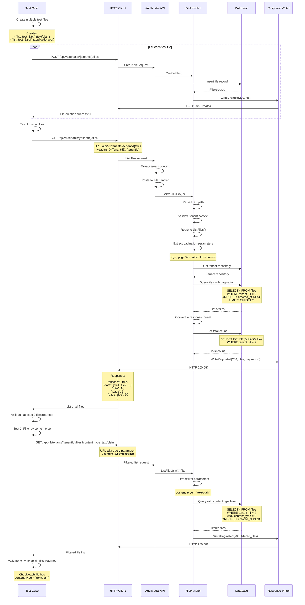

# Test Case: File List and Filtering

## Overview
This test validates the ability to list files for a tenant and filter them by content type, demonstrating the file listing and filtering functionality.

## Call Flow



## Request Details

### Step 1: Create Test Files (Setup)
```
POST /api/v1/tenants/9855e094-36a6-4d3a-a4f5-d77da4614439/files
```

**File 1 - Text File:**
```json
{
  "filename": "list_test_1.txt",
  "extension": "txt",
  "content_type": "text/plain",
  "size": 100,
  "checksum": "checksum1",
  "checksum_type": "sha256"
}
```

**File 2 - PDF File:**
```json
{
  "filename": "list_test_2.pdf",
  "extension": "pdf",
  "content_type": "application/pdf",
  "size": 200,
  "checksum": "checksum2",
  "checksum_type": "sha256"
}
```

### Step 2: List All Files
```
GET /api/v1/tenants/9855e094-36a6-4d3a-a4f5-d77da4614439/files
```

### Step 3: Filter by Content Type
```
GET /api/v1/tenants/9855e094-36a6-4d3a-a4f5-d77da4614439/files?content_type=text/plain
```

**Headers (for all requests):**
```
X-Tenant-ID: 9855e094-36a6-4d3a-a4f5-d77da4614439
```

## Response Details

### List All Files Response (200 OK)
```json
{
  "success": true,
  "data": [
    {
      "id": "file-uuid-1",
      "tenant_id": "9855e094-36a6-4d3a-a4f5-d77da4614439",
      "filename": "list_test_1.txt",
      "extension": "txt",
      "content_type": "text/plain",
      "size": 100,
      "created_at": "2025-08-14T01:31:00Z"
    },
    {
      "id": "file-uuid-2",
      "tenant_id": "9855e094-36a6-4d3a-a4f5-d77da4614439",
      "filename": "list_test_2.pdf",
      "extension": "pdf",
      "content_type": "application/pdf",
      "size": 200,
      "created_at": "2025-08-14T01:31:01Z"
    }
  ],
  "pagination": {
    "page": 1,
    "page_size": 50,
    "total": 19,
    "offset": 0
  },
  "timestamp": "2025-08-14T01:31:02Z",
  "request_id": "req_123456794"
}
```

### Filtered List Response (200 OK)
```json
{
  "success": true,
  "data": [
    {
      "id": "file-uuid-1",
      "tenant_id": "9855e094-36a6-4d3a-a4f5-d77da4614439",
      "filename": "list_test_1.txt",
      "extension": "txt",
      "content_type": "text/plain",
      "size": 100,
      "created_at": "2025-08-14T01:31:00Z"
    }
  ],
  "pagination": {
    "page": 1,
    "page_size": 50,
    "total": 8,
    "offset": 0
  },
  "timestamp": "2025-08-14T01:31:03Z",
  "request_id": "req_123456795"
}
```

## Key Implementation Details

1. **Pagination**: Default page size is 50, results are paginated
2. **Sorting**: Files are ordered by `created_at DESC` (newest first)
3. **Filtering**: Supports multiple filter parameters in query string
4. **Tenant Scoping**: Only files for the specific tenant are returned
5. **Count Query**: Separate query to get total count for pagination

## Available Filters

The API supports these query parameters:

| Filter | Example | Description |
|--------|---------|-------------|
| `status` | `?status=discovered` | Filter by file status |
| `content_type` | `?content_type=text/plain` | Filter by MIME type |
| `extension` | `?extension=pdf` | Filter by file extension |
| `data_source_id` | `?data_source_id=uuid` | Filter by data source |
| `session_id` | `?session_id=uuid` | Filter by processing session |
| `pii_detected` | `?pii_detected=true` | Filter by PII detection status |

## Test Validations

### List All Files Test:
1. **Status Code**: Verify HTTP 200 OK
2. **Data Array**: Confirm response contains file array
3. **Minimum Count**: At least 2 files returned (the ones we created)
4. **Pagination**: Check pagination metadata is present
5. **File Fields**: Verify each file has required fields

### Filter by Content Type Test:
1. **Status Code**: Verify HTTP 200 OK
2. **Filter Accuracy**: All returned files have correct content_type
3. **Exclusion**: Files with different content types are excluded
4. **Data Integrity**: Filtered files contain complete data

## Database Query Patterns

### List All Files:
```sql
SELECT * FROM files 
WHERE tenant_id = ? 
ORDER BY created_at DESC 
LIMIT ? OFFSET ?
```

### With Content Type Filter:
```sql
SELECT * FROM files 
WHERE tenant_id = ? 
AND content_type = ? 
ORDER BY created_at DESC 
LIMIT ? OFFSET ?
```

### Count Query:
```sql
SELECT COUNT(*) FROM files 
WHERE tenant_id = ? 
[AND filter_conditions...]
```

## Use Cases

1. **File Management UI**: Display files in admin interfaces
2. **Content Type Analysis**: Group files by type for processing
3. **Audit and Reporting**: List files for compliance reporting
4. **Bulk Operations**: Find files matching criteria for batch processing
5. **Storage Analysis**: Understand file distribution and usage

## Performance Considerations

- **Indexing**: Queries use indexed fields (tenant_id, created_at)
- **Pagination**: Prevents large result sets from overwhelming clients
- **Efficient Filtering**: Database-level filtering reduces data transfer
- **Separate Count**: Count query runs separately for accurate pagination

## Notes

- The test creates files specifically for testing list functionality
- Filters can be combined (e.g., `?content_type=text/plain&status=discovered`)
- Total count includes all files matching filters, not just current page
- Files from previous tests may appear in the list (total > 2)
- Pagination defaults handle large datasets automatically
- Tenant isolation ensures security across multi-tenant usage