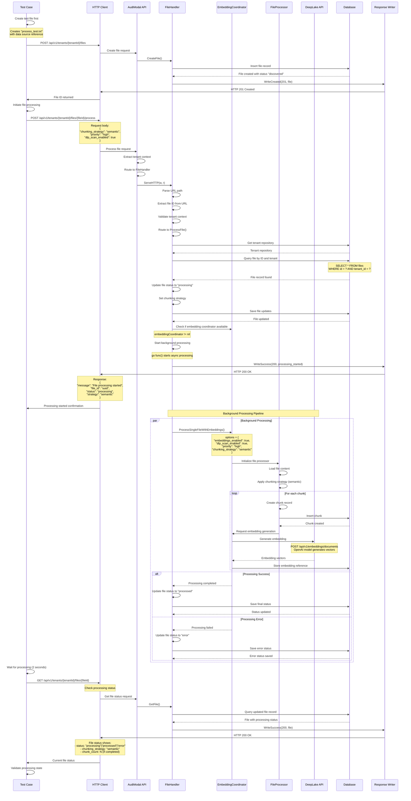

# Test Case: File Processing with Embedding Generation

## Overview
This test validates the complete file processing pipeline including chunk generation, embedding creation, and integration with DeepLake vector database. It demonstrates the POST `/api/v1/tenants/{tenantId}/files/{fileId}/process` endpoint functionality.

## Call Flow



## Request Details

### Step 1: Create File (Setup)
```
POST /api/v1/tenants/9855e094-36a6-4d3a-a4f5-d77da4614439/files
```

**Request Body:**
```json
{
  "filename": "process_test.txt",
  "extension": "txt",
  "content_type": "text/plain",
  "size": 150,
  "checksum": "process-test-checksum",
  "checksum_type": "sha256",
  "data_source_id": "uuid-of-data-source"
}
```

### Step 2: Initiate Processing
```
POST /api/v1/tenants/9855e094-36a6-4d3a-a4f5-d77da4614439/files/{fileId}/process
```

**Request Body:**
```json
{
  "chunking_strategy": "semantic",
  "priority": "high",
  "dlp_scan_enabled": true
}
```

### Step 3: Check Processing Status
```
GET /api/v1/tenants/9855e094-36a6-4d3a-a4f5-d77da4614439/files/{fileId}
```

**Headers (for all requests):**
```
X-Tenant-ID: 9855e094-36a6-4d3a-a4f5-d77da4614439
Content-Type: application/json
```

## Response Details

### File Processing Response (200 OK)
```json
{
  "success": true,
  "data": {
    "message": "File processing started",
    "file_id": "extracted-file-uuid",
    "status": "processing",
    "strategy": "semantic"
  },
  "timestamp": "2025-08-14T01:32:00Z",
  "request_id": "req_123456796"
}
```

### File Status After Processing (200 OK)
```json
{
  "success": true,
  "data": {
    "id": "extracted-file-uuid",
    "tenant_id": "9855e094-36a6-4d3a-a4f5-d77da4614439",
    "filename": "process_test.txt",
    "extension": "txt",
    "content_type": "text/plain",
    "size": 150,
    "status": "processed",
    "chunking_strategy": "semantic",
    "chunk_count": 3,
    "processing_tier": "standard",
    "processed_at": "2025-08-14T01:32:05Z",
    "processing_duration": 5000,
    "embedding_status": "completed",
    "created_at": "2025-08-14T01:32:00Z",
    "updated_at": "2025-08-14T01:32:05Z"
  },
  "timestamp": "2025-08-14T01:32:07Z",
  "request_id": "req_123456797"
}
```

## Key Implementation Details

1. **Asynchronous Processing**: File processing runs in background goroutine
2. **Status Tracking**: File status changes from "discovered" → "processing" → "processed"/"error"
3. **Embedding Integration**: Coordinates with DeepLake API for vector generation
4. **Chunking Strategy**: Supports different strategies (semantic, fixed-size, etc.)
5. **DLP Integration**: Optional data loss prevention scanning
6. **Priority Handling**: Processing can be prioritized (high, medium, low)

## Processing Pipeline Steps

1. **File Validation**: Verify file exists and is accessible
2. **Status Update**: Mark file as "processing"
3. **Content Extraction**: Read and parse file content
4. **Chunking**: Apply specified chunking strategy
5. **DLP Scanning**: Optional PII and sensitive data detection
6. **Embedding Generation**: Create vector embeddings for each chunk
7. **Storage**: Store chunks and embeddings in respective databases
8. **Completion**: Update file status and metadata

## Test Validations

### Processing Initiation Test:
1. **Status Code**: Verify HTTP 200 OK
2. **Response Format**: Check success response structure
3. **Processing Message**: Confirm "File processing started"
4. **File ID Match**: Ensure correct file ID returned
5. **Strategy Setting**: Verify chunking strategy is set

### Status Check Test:
1. **Status Code**: Verify HTTP 200 OK after processing
2. **Status Evolution**: File status should be processing/processed/error
3. **Strategy Persistence**: Chunking strategy should be preserved
4. **Metadata Updates**: Processing timestamps and duration populated
5. **Chunk Generation**: Chunk count should be updated (if completed)

## Error Scenarios

- **File Not Found**: 404 if file ID doesn't exist
- **Processing Already Started**: 409 if file is already processing
- **Embedding Service Unavailable**: 503 if DeepLake API is down
- **Invalid Strategy**: 400 for unsupported chunking strategies
- **Tenant Access**: 403 if file belongs to different tenant

## Use Cases

1. **Document Ingestion**: Process uploaded documents for search
2. **Batch Processing**: Handle multiple files with different strategies
3. **Embedding Generation**: Create searchable vector representations
4. **Content Analysis**: Apply DLP and classification during processing
5. **Search Preparation**: Make documents discoverable via semantic search

## Integration Points

### DeepLake API Integration:
- **Embedding Generation**: POST `/api/v1/embeddings/documents`
- **Vector Storage**: Chunks stored with metadata
- **Search Enablement**: Processed files become searchable

### Database Updates:
- **File Status**: Real-time status tracking
- **Chunk Records**: Individual chunks with positions
- **Processing Metadata**: Timestamps, duration, strategy
- **Error Logging**: Detailed error information for troubleshooting

## Performance Considerations

- **Asynchronous Processing**: Non-blocking API responses
- **Background Jobs**: Processing doesn't tie up request threads
- **Chunking Efficiency**: Strategy choice affects processing time
- **Embedding Batching**: Multiple chunks processed efficiently
- **Status Polling**: Clients can check progress periodically

## Notes

- Processing is asynchronous - response is immediate but processing continues
- File status must be checked separately to confirm completion
- Embedding generation requires OpenAI API key configuration
- DLP scanning adds processing time but improves compliance
- Chunking strategy affects search quality and performance
- Processing failures are logged and status updated accordingly