# Test Case: Vector Search Functionality

## Overview
This test validates the semantic search functionality that allows finding documents based on vector similarity. It demonstrates the POST `/api/v1/tenants/{tenantId}/files/search` endpoint functionality with the complete workflow of file creation, processing, and search.

## Call Flow

```mermaid
sequenceDiagram
    participant Test as Test Case
    participant Client as HTTP Client
    participant API as AudiModal API
    participant FileHandler as FileHandler
    participant EmbeddingCoord as EmbeddingCoordinator
    participant VectorDB as Vector Database
    participant OpenAI as OpenAI API
    participant DB as Database
    participant Response as Response Writer

    Test->>Test: Setup: Create and process file
    Note over Test: Creates "search_test.txt"<br/>and processes it for embeddings
    
    Test->>Client: POST /api/v1/tenants/{tenantId}/files
    Note over Client: Create file for search testing
    Client->>API: Create file request
    API->>FileHandler: CreateFile()
    FileHandler->>DB: Insert file record
    DB-->>FileHandler: File created
    FileHandler->>Response: WriteCreated(201, file)
    Response->>Client: HTTP 201 Created
    Client->>Test: File ID returned

    Test->>Client: POST /api/v1/tenants/{tenantId}/files/{fileId}/process
    Note over Client: Process file to generate embeddings
    Client->>API: Process file request
    API->>FileHandler: ProcessFile()
    FileHandler->>EmbeddingCoord: Generate embeddings
    EmbeddingCoord->>VectorDB: Store embeddings
    VectorDB-->>EmbeddingCoord: Embeddings stored
    EmbeddingCoord-->>FileHandler: Processing complete
    FileHandler->>Response: WriteSuccess(200, processing_started)
    Response->>Client: HTTP 200 OK
    Client->>Test: Processing started

    Test->>Test: Wait for processing completion (5 seconds)
    
    Test->>Test: Initiate vector search
    Test->>Client: POST /api/v1/tenants/{tenantId}/files/search
    Note over Client: Search query:<br/>{<br/>  "query": "artificial intelligence healthcare",<br/>  "top_k": 5,<br/>  "threshold": 0.7,<br/>  "filters": {"content_type": "text/plain"}<br/>}
    
    Client->>API: Vector search request
    
    API->>API: Extract tenant context
    API->>API: Route to FileHandler
    
    API->>FileHandler: ServeHTTP(w, r)
    
    FileHandler->>FileHandler: Parse URL path
    FileHandler->>FileHandler: Identify search endpoint
    FileHandler->>FileHandler: Validate tenant context
    FileHandler->>FileHandler: Route to SearchSimilarDocuments()
    
    FileHandler->>FileHandler: Validate request body
    FileHandler->>FileHandler: Extract search parameters
    Note over FileHandler: - query: string<br/>- top_k: int (default 10)<br/>- threshold: float (default 0.7)<br/>- filters: map
    
    FileHandler->>EmbeddingCoord: Check service availability
    Note over FileHandler: embeddingCoordinator != nil
    
    alt Embedding Service Available
        FileHandler->>EmbeddingCoord: SearchSimilarDocuments()
        Note over EmbeddingCoord: Search options:<br/>- TopK: 5<br/>- Threshold: 0.7<br/>- MetricType: "cosine"<br/>- IncludeContent: true<br/>- IncludeMetadata: true<br/>- Filters: {"content_type": "text/plain"}
        
        EmbeddingCoord->>OpenAI: Generate query embedding
        Note over OpenAI: POST /v1/embeddings<br/>Convert query to vector
        
        alt OpenAI Authentication Success
            OpenAI-->>EmbeddingCoord: Query embedding vector
            
            EmbeddingCoord->>VectorDB: Vector similarity search
            Note over VectorDB: Search for similar vectors<br/>using cosine similarity
            VectorDB-->>EmbeddingCoord: Matching documents with scores
            
            EmbeddingCoord->>EmbeddingCoord: Apply threshold filtering
            EmbeddingCoord->>EmbeddingCoord: Apply metadata filters
            EmbeddingCoord->>EmbeddingCoord: Format search results
            
            EmbeddingCoord-->>FileHandler: Search results
            FileHandler->>Response: WriteSuccess(200, results)
            Response->>Client: HTTP 200 OK
            Note over Client: Response:<br/>{<br/>  "success": true,<br/>  "data": {<br/>    "results": [...],<br/>    "query": "...",<br/>    "total_results": N<br/>  }<br/>}
            
        else OpenAI Authentication Failed
            OpenAI-->>EmbeddingCoord: HTTP 401 Unauthorized
            EmbeddingCoord-->>FileHandler: Authentication error
            FileHandler->>Response: WriteInternalServerError(500, error)
            Response->>Client: HTTP 500 Internal Server Error
            Note over Client: Response:<br/>{<br/>  "success": false,<br/>  "error": {<br/>    "code": "INTERNAL_SERVER_ERROR",<br/>    "message": "Failed to search documents",<br/>    "details": "HTTP 401"<br/>  }<br/>}
        end
        
    else Embedding Service Unavailable
        FileHandler->>Response: WriteError(503, service_unavailable)
        Response->>Client: HTTP 503 Service Unavailable
        Note over Client: Vector search service not available
    end
    
    Client->>Test: Search response or error
    Test->>Test: Validate response
    
    Test->>Test: Test invalid query scenario
    Test->>Client: POST /api/v1/tenants/{tenantId}/files/search
    Note over Client: Empty query test:<br/>{"query": "", "top_k": 5}
    
    Client->>API: Invalid search request
    API->>FileHandler: SearchSimilarDocuments()
    FileHandler->>FileHandler: Validate query parameter
    Note over FileHandler: query == "" → validation failure
    FileHandler->>Response: WriteBadRequest(400, "Query is required")
    Response->>Client: HTTP 400 Bad Request
    Client->>Test: Validation error response
    Test->>Test: Verify error handling
```



## Request Details

### Step 1: Create File (Setup)
```
POST /api/v1/tenants/9855e094-36a6-4d3a-a4f5-d77da4614439/files
```

**Request Body:**
```json
{
  "filename": "search_test.txt",
  "extension": "txt", 
  "content_type": "text/plain",
  "size": 200,
  "checksum": "search-test-checksum",
  "checksum_type": "sha256",
  "data_source_id": "uuid-of-data-source"
}
```

### Step 2: Process File (Setup)
```
POST /api/v1/tenants/9855e094-36a6-4d3a-a4f5-d77da4614439/files/{fileId}/process
```

**Request Body:**
```json
{
  "chunking_strategy": "semantic",
  "priority": "high",
  "dlp_scan_enabled": false
}
```

### Step 3: Vector Search
```
POST /api/v1/tenants/9855e094-36a6-4d3a-a4f5-d77da4614439/files/search
```

**Request Body:**
```json
{
  "query": "artificial intelligence healthcare machine learning",
  "top_k": 5,
  "threshold": 0.7,
  "filters": {
    "content_type": "text/plain"
  }
}
```

### Step 4: Invalid Query Test
```
POST /api/v1/tenants/9855e094-36a6-4d3a-a4f5-d77da4614439/files/search
```

**Request Body:**
```json
{
  "query": "",
  "top_k": 5
}
```

**Headers (for all requests):**
```
X-Tenant-ID: 9855e094-36a6-4d3a-a4f5-d77da4614439
Content-Type: application/json
```

## Response Details

### Successful Search Response (200 OK)
```json
{
  "success": true,
  "data": {
    "results": [
      {
        "id": "chunk-uuid-1",
        "file_id": "file-uuid",
        "content": "Document content chunk...",
        "metadata": {
          "filename": "search_test.txt",
          "content_type": "text/plain",
          "chunk_number": 1
        },
        "score": 0.89,
        "distance": 0.11
      }
    ],
    "query": "artificial intelligence healthcare machine learning",
    "total_results": 3,
    "search_time_ms": 45
  },
  "timestamp": "2025-08-14T02:14:43Z",
  "request_id": "req_123456798"
}
```

### Service Error Response (500 Internal Server Error)
```json
{
  "success": false,
  "error": {
    "code": "INTERNAL_SERVER_ERROR",
    "message": "Failed to search documents",
    "details": "HTTP 401"
  },
  "request_id": "req_123456799",
  "timestamp": "2025-08-14T02:14:43Z"
}
```

### Service Unavailable Response (503 Service Unavailable)
```json
{
  "success": false,
  "error": {
    "code": "EMBEDDING_SERVICE_UNAVAILABLE",
    "message": "Vector search service is not available"
  },
  "request_id": "req_123456800",
  "timestamp": "2025-08-14T02:14:43Z"
}
```

### Invalid Query Response (400 Bad Request)
```json
{
  "success": false,
  "error": {
    "code": "BAD_REQUEST",
    "message": "Query is required"
  },
  "request_id": "req_123456801",
  "timestamp": "2025-08-14T02:14:43Z"
}
```

## Key Implementation Details

1. **Query Embedding**: User query is converted to vector using OpenAI embeddings
2. **Vector Similarity**: Uses cosine similarity for document matching
3. **Threshold Filtering**: Only returns results above similarity threshold
4. **Metadata Filtering**: Supports filtering by file attributes
5. **Result Ranking**: Results ordered by similarity score (descending)
6. **Service Dependency**: Requires OpenAI API key for embedding generation

## Search Parameters

| Parameter | Type | Default | Description |
|-----------|------|---------|-------------|
| `query` | string | required | Text query to search for |
| `top_k` | integer | 10 | Maximum number of results to return |
| `threshold` | float | 0.7 | Minimum similarity score (0.0-1.0) |
| `filters` | object | null | Metadata filters to apply |

## Supported Filters

| Filter | Example | Description |
|--------|---------|-------------|
| `content_type` | `"text/plain"` | Filter by MIME type |
| `file_extension` | `"pdf"` | Filter by file extension |
| `data_source_id` | `"uuid"` | Filter by data source |
| `created_after` | `"2025-01-01"` | Filter by creation date |
| `language` | `"en"` | Filter by detected language |

## Test Validations

### Successful Search Test:
1. **Status Code**: Verify HTTP 200 OK (when service available)
2. **Response Structure**: Check success response format
3. **Results Array**: Verify results contain expected fields
4. **Query Echo**: Confirm query is echoed in response
5. **Score Ordering**: Results should be ordered by similarity score

### Error Handling Tests:
1. **Service Unavailable**: HTTP 503 when embedding service down
2. **Authentication Error**: HTTP 500 when OpenAI API key invalid
3. **Invalid Query**: HTTP 400 for empty or invalid queries
4. **Graceful Degradation**: Proper error messages and codes

## Error Scenarios

- **Empty Query**: 400 Bad Request - Query parameter is required
- **Invalid Threshold**: 400 Bad Request - Threshold must be 0.0-1.0
- **Service Unavailable**: 503 Service Unavailable - Embedding coordinator not initialized
- **Authentication Failed**: 500 Internal Server Error - OpenAI API authentication failed
- **Vector DB Error**: 500 Internal Server Error - Vector database connection issues
- **Tenant Access**: 403 Forbidden - Search limited to tenant's documents

## Use Cases

1. **Document Discovery**: Find relevant documents based on natural language queries
2. **Content Similarity**: Identify documents with similar content
3. **Knowledge Retrieval**: Extract information from document collections
4. **Research Support**: Find related documents for analysis
5. **Content Classification**: Group documents by semantic similarity

## Integration Points

### OpenAI API Integration:
- **Embedding Generation**: POST `/v1/embeddings` to convert query to vector
- **Model**: Uses text-embedding-ada-002 or similar
- **Authentication**: Requires valid OpenAI API key
- **Rate Limiting**: Subject to OpenAI API rate limits

### Vector Database Integration:
- **Storage**: Document embeddings stored in vector database
- **Search**: Cosine similarity search across stored vectors
- **Filtering**: Combined vector search with metadata filtering
- **Performance**: Optimized for sub-second search response times

## Performance Considerations

- **Embedding Generation**: Query embedding adds ~100-300ms latency
- **Vector Search**: Typically completes in 10-50ms
- **Result Size**: Limited by top_k parameter to control response size
- **Caching**: Query embeddings could be cached for repeated searches
- **Indexing**: Vector database should be properly indexed for performance

## Notes

- Search requires files to be processed and have embeddings generated
- Service gracefully handles missing API keys with appropriate error messages
- Threshold filtering improves result relevance but may reduce result count
- Metadata filters are applied after vector similarity matching
- Search is scoped to tenant's documents for security
- Processing files before search is essential for meaningful results
- Authentication errors (HTTP 401) indicate missing or invalid OpenAI API key
- The test properly handles and validates different error scenarios